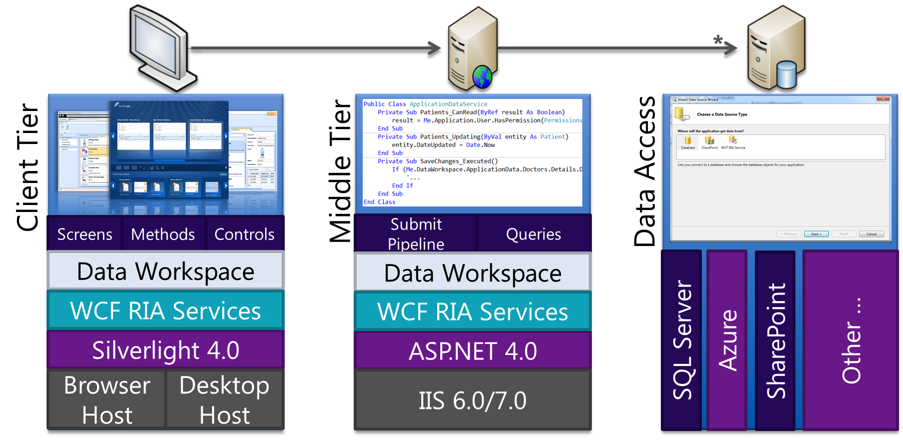

# Introducció a la programació web

!!! important "Objectius"
    - Seleccionar les arquitectures i tecnologies de programació web en
    entorn servidor, analitzant-ne les capacitats i característiques
    pròpies.
    - Introduir els principals llenguatges i frameworks per al
    desenvolupament en l'entorn servidor.
    - Caracteritzar i diferenciar els models d'execució de codi en el
    servidor i en el client web.
    - Identificar les principals tecnologies associades.
    - Instal·lar i configurar l'entorn de treball que emprarem per al
    desenvolupament web.
    - Visualitzar mitjançant el navegador una pàgina web html amb codi PHP
    encastat.

## Arquitectura d'una aplicació web

A diferència de les aplicacions d'escriptori, que utilitzen els recursos d'un únic ordinador
les aplicacions web són distribuïdes, intervenen com a mínin dos equipos diferents: el client i el servidor.

La comunicació és du a terme mitjançant el protocol HTTP, base
de la _World Wide Web_.

### El model client/servidor

El model client-servidor és aquell on tots els clients estan connectats
a un servidor on es centralitzen els diferents recursos. Aquests
recursos estan a disposició dels clients cada cop que els sol·liciten.
Això fa que totes les gestions que es realitzen es concentren en el
servidor, que disposa dels requeriments dels clients amb prioritat, els
arxius que són d'ús públic i els restringits, els arxius de només
lectura, els que poden ser modificats, etc.

<figure markdown>

<figcaption>
Arquitectura Client Servidor.
</figcaption>
</figure>

En el model client/servidor, el dispositiu que sol·licita informació es
denomina client i el dispositiu que respon la sol·licitud es denomina
servidor. Els processos de client i servidor es consideren una part de
la capa d'aplicació. El client comença l'intercanvi sol·licitant les
dades al servidor, que respon enviant un o més blocs de dades al client.
Els protocols de capa d'aplicació descriuen el format de les
sol·licituds i respostes entre clients i servidor. A més de la
transferència real de dades, aquest intercanvi pot requerir informació
addicional, com l'autentificació de l'usuari o la identificació d'un
arxiu de dades per transferir.

Encara que les dades generalment es descriuen com un flux del servidor
al client, algunes dades sempre flueixen del client al servidor. El flux
de dades pot ser el mateix en les dues direccions o fins i tot ser major
en la direcció que va del client al servidor. Per exemple, un client pot
transferir un arxiu al servidor amb finalitats d'emmagatzemament. La
transferència de dades d'un client a un servidor es coneix com a pujada
i la de les dades d'un servidor a un client, baixada.

### El protocol HTTP

El protocol de transferència d'hipertext (HTTP) és un protocol
client-servidor molt senzill que articula els intercanvis d'informació
entre els clients HTTP (navegadors) i els servidors HTTP.

**HTTP es basa en operacions senzilles de sol·licitud/resposta.** Quan
un client estableix una connexió amb un servidor i envia un missatge amb
les dades de la sol·licitud, el servidor respon amb un missatge similar
que conté l'estat de l'operació i el seu resultat de la sol·licitud.
Totes les operacions poden adjuntar un objecte o recurs sobre el qual
actuen; cada objecte web (document HTML, arxiu multimèdia o aplicació
CGI) és conegut pel seu localitzador uniforme de recursos (URL, _Uniform
Resource Locator_). Els recursos poden ser arxius, el resultat de
l'execució d'un programa, una consulta a una base de dades, la
traducció automàtica d'un document, etc.

**HTTP és un protocol sense estat**, és a dir, no guarda cap informació
sobre connexions anteriors. El desenvolupament d'aplicacions web
freqüentment necessita mantenir estat. Per això s'utilitzen les galetes
(_cookies_), és a dir, la informació que un servidor pot emmagatzemar en
el sistema client. Això permet que les aplicacions web institueixin la
noció de "sessió", i, alhora, permet rastrejar usuaris, ja que les
galetes es poden emmagatzemar en el client durant un temps indeterminat.

Per a conèixer amb més profunditat el protocol HTTP  avaluarem en què consisteix una transacció HTTP. Cada vegada que un client fa una petició a un servidor, s'executen un
seguit d'accions:

1. Un usuari accedeix a una adreça d'Internet (URL) seleccionant un
    enllaç d'un document HTML o introduint-la directament a la barra de
    navegació d'un navegador web des de la perspectiva del client web.
    El client web descodifica l'adreça d'Internet (URL) separant-ne les
    diferents parts. És així com s'identifiquen el protocol d'accés,
    el node, expressat amb el nom de domini o la seua adreça IP, el
    possible port opcional (el valor per defecte és el 80) i l'objecte
    del servidor requerit.
2. S'obre una connexió TCP/IP amb el servidor cridant el port TCP
    corresponent. Es fa la petició. En conseqüència, s'envien l'ordre
    necessària (GET, POST, HEAD, etc.), l'adreça de l'objecte requerit
    (el contingut de l'adreça d'Internet del servidor), la versió del
    protocol HTTP utilitzada (en la major part de les ocasions és
    HTTP/1.1) i un conjunt variable d'informació que inclou dades sobre
    les capacitats del navegador web, dades opcionals per al servidor,
    etc.
3. El servidor localitza el recurs sol·licitat i torna la resposta al
    client.
4. Aquesta resposta consisteix en **un codi d'estat** i **el tipus de dada**
    amb extensions multipropòsit de correu d'Internet (MIME,
    Multipurpose Internet Mail Extension) de la informació de tornada,
    seguit de la mateixa informació.
5. El client formata i mostra el recurs rebut.
6. Es tanca la connexió TCP.

!!! important
    Aquest procés es repeteix en cada accés que es faça al servidor HTTP.
    Per exemple, si es recull un document HTML que conté quatre imatges, el
    procés de transició mostrat amb anterioritat es repeteix cinc vegades,
    és a dir, una pel document HTML i quatre per les imatges.

<figure markdown>

<figcaption>Etapes d'una transacció HTTP</figcaption>
</figure>
Si el recurs sol·licitat és un programa (CGI, ASP.NET, PHP, etc.) el
servidor HTTP redirigirà la petició a la llibreria o intèrpret adequat
que executarà el programa i tornarà el control al servidor web.

<figure markdown>

<figcaption>Etapes d'una sol·licitud HTTP amb processament per part del servidor
</figure>

### Format de les URL

La sintaxi general de les URL consisteix en una seqüència jeràrquica de
5 components:

    URI = scheme:[//authority]path[?query][#fragment]

on el component `authoriry` es deivideix en tres subcomponents:

    authority = [userinfo@]host[:port]

<figure markdown>

<figcaption>Sintaxi de les URL</figcaption>
</figure>

## Servidors web i servidors d'aplicacions

Així com les aplicacions d'escriptori s'executen directament sobre el
sistema operatiu, les aplicacions web necessiten d'una
eina addicional que permeti desplegar-les per a la seva posada en marxa.
Parlem de [servidors
web](https://en.wikipedia.org/wiki/Comparison_of_web_server_software) i
[servidors
d'aplicacions](https://en.wikipedia.org/wiki/Application_server),
respectivament.

**Un servidor web** és una aplicació que rep una petició HTTP (normalment a
través d'un navegador web) i retorna la pàgina web sol·licitada
(escrita en llenguatge HTML i podent contenir codi Javascript
encastat) perquè aquesta sigua interpretada i visualitzada pel
navegador de qui va realitzar la sol·licitud (l'usuari).

**Un servidor d'aplicacions** és un servidor que permet l'execució d'aplicacions web.

### Exemples

#### Apache

Apache és un dels servidors web més coneguts. És programari lliure i
multiplataforma, encara que aproximadament el 90% dels servidors Apache
s'executen actualment en entorns Linux ja que és el servidor preferit
per a aquesta plataforma.

És molt modular el que permet incorporar característiques un cop
instal·lat i posat en marxa. Això li fa també molt flexible i pot donar
servei a webs escrites en els llenguatges de programació web més estesos
(com PHP, Python, ASP,\...) A través del mòdul corresponent.

#### nginx

nginx (pronunciat en anglès "engine X") és un servidor web/proxy invers lleuger d'alt rendiment i un proxy per protocols de correu electrònic ( IMAP / POP3).

#### PHP-FPM
_FastCGI Process Manager_ és un servei que permet executar codi PHP separat del servidor HTTP de forma que millora la seua flexibilitat i el seu rendiment.

## Pàgines web estàtiques i dinàmiques

### Pàgines web estàtiques

Les pàgines web estàtiques són aquelles en que el seu contingut no varia, per
la qual cosa mostraran sempre la mateixa informació cada vegada que es
carreguen. Són les pàgines creades en el llenguatge HTML, CSS i javascript.

Les pàgines estàtiques només canvien si el programador web les modifica.

### Pàgines web dinàmiques

Les pàgines web dinàmiques són pàgines el contingut de les quals varia a
partir de certa informació: base de dades, identificació de l'usuari, hora del dia, etc.

Aquest tipus de pàgines s'han de realitzar mitjançat un llenguatge de
programació.

### Execució de codi en el client i en el servidor

Pel que hem pogut veure fins ara en el desenvolupament d'una aplicació web podem distingir entre una sèrie de tecnologies que s'executen en el navegador (_client-side o front-end programming_) i un sèrie de tecnologies que s'executen en el servidor (_server-side_ o _back-end programming_)

En el següent gràfic es mostra un escenari on podem trobar codi que
s'executa en el servidor (PHP) i en el client (javascript).
<figure markdown>

<figcaption>
    Execució de codi en el client i en el servidor
</figcaption>
</figure>

## Model de desenvolupament en 3 capes

Des d'un punt de vista de desenvolupament una aproximació més detallada
al model client-servidor és el que es coneix com a **model en 3 capes**.
És un model on es mostra més en detall com es distribueix el programari
que participa en qualsevol desenvolupament web. Segueix estant present
l'arquitectura client-servidor (tot es basa en ella) però apareixen més
detalls com el programari utilitzat en cada un dels dos actors i com
interactuen les diferents tecnologies o aplicacions.

Per comprendre millor que és el model de desenvolupament de 3 capes
podem observar el següent esquema on es mostra cadascuna d'aquestes
capes físíques :

<figure markdown>


<figcaption>Model de desenvolupament de 3 capes</figcaption>
</figure>
Des d'un punt de vista lògic les capes (_layers_) es divideixen les següents funcionalitats:

- **Capa de presentació:** És la capa on l'aplicació es mostra a
    l'usuari. Bàsicament és la GUI (*Graphical User Interface,
    interfície gràfica d'usuari*). En el cas d'una aplicació web seria
    el codi HTML que es carrega directament al navegador web. En
    qualsevol cas, s'executa directament en l'equip del client.
- **Capa d'aplicació:** És la capa intermèdia on es porta a terme tota
    la lògica de l'aplicació. Sempre s'executarà en el costat
    servidor. Aquesta capa, després de realitzar tots els càlculs i/o
    operacions sobre les dades, genera el codi HTML que serà presentat a
    l'usuari en la capa següent.

    Sols estar desenvolupada usant PHP, Pyhton, Java, etc i es comunica amb la capa de dades mitjançant una API.

- **Capa de dades:** És la capa que emmagatzema les dades. Bàsicament,
    en condicions normals, fa referència al propi SGBD que és
    l'encarregat d'emmagatzemar les dades. Depenent de l'arquitectura
    de l'aplicació, aquesta capa i la de negoci es poden trobar
    físicament en el mateix equip, encara que també és possible que
    s'hagin de separar per qüestions de rendiment. La capa de dades
    serveix totes la informació necessària a la capa de negoci per dur a
    terme les seves operacions.

Si ens imaginem una botiga online, la capa de dades emmagatzemaria tota la
informació en una base de dades (usuaris, comandes, articles,
ofertes,...). La capa d'aplicació hauria d'accedir a aquesta informació i,
després processar una comanda, per exemple i finalment presentar el resultat
a l'usuari en el navegador, que és la capa de presentació.

I si ens centrem en un cas concret amb programari i tecnologies ja
definits, un model de 3 capes podria ser el següent:

<figure markdown>
")
<figcaption>
    Modelo de desarrollo de 3 capas (desarrollo web con PHP)
</figcaption>
</figure>

- Navegador web: En aquest cas, Mozilla Firefox, Internet Explorer o
    Google Chrome podrien ser qualsevol de les aplicacions que ocuparien
    aquesta capa
- Apache + PHP / IIS + ASP: Un servidor web acompanyat del seu
    corresponent llenguatge de programació web permeten desenvolupar la
    part que ocupa la capa de negoci. També podríem col·locar la
    combinació Apache Tomcat + Servlets
- MySQL / PostgreSQL / Node: Finalment a la capa de dades podem posar
    qualsevol SGBD, com poden ser MySQL o PostgreSQL.

L'avantatge principal d'aquest model és que el desenvolupament es pot
dur a terme en diversos nivells i, en cas que sobrevinga algun canvi,
només afectarà el nivell requerit sense haver de revisar entre el codi
font d'altres mòduls, atès que s'haurà reduït el acoblament informàtic
fins a una interfície de pas de missatges.

### Front-end, back-end, Full stack

També tenint en compte en quin costat se situen les tecnologies i per a
què s'utilitzen aquestes, actualment es parla molt de 3 perfils 
diferenciats en l'àmbit del desenvolupament web:

- **Front-end:** És la part del desenvolupament que s'encarrega del
    disseny i maquetació de l'aplicació web utilitzant tecnologies com
    HTML, CSS i Javascript (i els seus frameworks). En aquest cas s'ha
    de preocupar també de la correcta presentació en qualsevol tipus de
    dispositiu i fins i tot del posicionament en cercadors
- **Back-end:** És la part del desenvolupament que s'encarrega del
    costat servidor utilitzant tecnologies com PHP, JSP i Python. També
    s'encarrega de l'administració del servidor d'aplicacions i la
    base de dades.
- **Full stack:** En un perfil que engloba els dos anteriors. En
    aquest cas el desenvolupador potser no és un expert de cap
    tecnologia concreta però té amplis coneixements de tot el conjunt i
    és capaç de col·laborar en qualsevol de les parts.

<figure markdown>


<figcaption>
    Fullstack
</figcaption>
</figure>

### Tipogia de les aplicacions web

Depenent de la forma en què s'utilitzen les tecnologies podem classificar les aplicacions en:

- Tradicionals o clàssiques, on pràctimanent tota la lògica i la presentenció es genera en el costat de servidor.
- Híbidres on una aplicació tradicional incorpora tecnologies en el costat del client per a millorar l'experiència de l'usuari.
- _Single Page Applications_ (SPA). En el costat servidor es generen una sèrie de funcionalitats accessibles mitjançant una API i tota la càrrega de la presentació és realitza en el costat del client que s'encarrega a més realizar les sol·licitus a la API.

<figure markdown>

<figcaption>
Arquitectura tradicional vs SPA</figcaption>
</figure>


## Llenguatges

### PHP

PHP (_PHP Hypertext Preprocessor_) és un llenguatge de programació de
costat servidor dissenyat principalment per al desenvolupament web.

PHP s'utilitza com a llenguatge de script embegut en pàgines HTML i
funciona, normalment, com un mòdul del servidor web (per exemple, a
Apache). El servidor web combina els resultats d'executar els scripts
PHP amb l'HTML al qual va encastat i genera la pàgina web resultant per
al navegador.

Actualment PHP funciona pràcticament amb qualsevol servidor web i en
qualsevol Sistema Operatiu existents, i gairebé amb qualsevol SGBD en
cas que necessitem utilitzar una base de dades. Tot i això, el més
habitual és veure-ho formant el que es coneix com una arquitectura LAMP
(Linux, Apache, MySQL i PHP), és a dir, funcionant sobre un sistema
operatiu Linux, executant-com un mòdul del servidor web Apache i
utilitzant a MySQL com SGBD per emmagatzemar la informació en cas que es
requereixi una base de dades.

<figure markdown>

<figcaption>Arquitectura LAMP</figcaption>
</figure>

El llenguatge PHP va ser dissenyat per Rasmus Lerdorf i ara es manté per
una comunitat de desenvolupadors, a més és de codi obert.

A continuació, un fragment d'una pàgina web dinàmica escrita amb PHP on
es pot apreciar com s'incrusta el codi juntament amb l'HTML de la
pàgina:

### JSP / Servlets

JavaServer Pages (també conegut com JSP) és una tecnologia creada per a
la creació de pàgines web dinàmiques del costat servidor. Igual que PHP,
el seu codi s'escriu encastat juntament amb l'HTML de la pàgina web i
és el servidor d'aplicacions, en aquest cas, qui ha de processar-per
generar la pàgina web resultant, en HTML.

D'altra banda, Java Servlets és una tecnologia que també es pot
utilitzar per crear contingut web dinàmic però que a més estén la seva
funcionalitat a la possibilitat de connectar aquestes webs dinàmiques
amb un altre contingut accessible a través d'Internet. De vegades
s'utilitza juntament amb JSP per crear aplicacions web més complexes.

Totes dues són tecnologies desenvolupades per Sun Microsystems i
propietat ara d'Oracle, després d'adquirir aquesta última a la primera
fa ja alguns anys.


### Python

El llenguatge Python va ser dissenyat per Guido van Rossum i ara es
manté gràcies a una comunitat de desenvolupadors, i és codi obert.


Exemple de codi escrit amb Python. En aquest cas utilitzant el framework
Django per al desenvolupament d'aplicacions web:

```html
<h1>Mis películas</h1> <a href="#">+</a>

  <ul>
    
    <li><a href="">{{ pelicula.titulo }}</a></li>
    
    </ul>
    
    <p>No hay películas disponibles</p>
    
```

Separada del controlador:

```python
    from django.shortcuts import render

    . . .

    def index(request):
    lista_peliculas = Pelicula.objects.all()
    context = {'lista_peliculas': lista_peliculas}
    return render(request, 'mispeliculas/index.html', context)

```

### ASP.NET

ASP.NET és una tecnologia, creada per Microsoft, per al desenvolupament
de lloc web dinàmics, aplicacions i serveis web. És la tecnologia
successora del que abans es coneixia com ASP, l'antiga tecnologia de
Microsoft per a la creació de pàgines web dinàmiques.

Com que funciona sobre la plataforma .NET de Microsoft, permet que es
pugui desenvolupar en qualsevol dels llenguatges de programació
d'aquesta plataforma, Visual Basic .NET o C\#.

El més habitual és veure-ho funcionar juntament amb el lloc web de
Microsoft, IIS (Internet Information Server).



A continuació, un exemple de pàgina web dinàmica amb ASP.NET
(desenvolupada en llenguatge C \#) programant l'acció que passa en
prémer un botó (apareix el text d'un formulari a la part final del
web):

```asp
protected void Button1_Click(object sender, EventArgs e)
{
    string buf = TextBox1.Text;
    changed_text.InnerHtml = buf.ToUpper();
}
```

```html
<%@ Page Language="C#" AutoEventWireup="true" CodeBehind="Default.aspx.cs"
    Inherits="firstexample._Default" %>

<!DOCTYPE html PUBLIC "-//W3C//DTD XHTML 1.0 Transitional//EN" 
    "http://www.w3.org/TR/xhtml1/DTD/xhtml1-transitional.dtd">

<html xmlns="http://www.w3.org/1999/xhtml" >

    <head runat="server">
        <title>
            Untitled Page
        </title>
    </head>

    <body>
        <form id="form1" runat="server">
        <div>
            <asp:TextBox ID="TextBox1" runat="server" style="width:224px">
            </asp:TextBox>
        
            <asp:Button ID="Button1" runat="server" Text="Enter..." 
                style="width:85px" onclick="Button1_Click" />
            <hr />

            <h3> Results: </h3>
            <span runat="server" id="changed_text" />
        </div>

    </form>
    </body>
    </html>
```

## Bibliografia

- Education, I., 2020. _What is Three-Tier Architecture_. [online] Ibm.com. Available at: <https://www.ibm.com/cloud/learn/three-tier-architecture> [Accessed 9 September 2022].
- MDN contributors, 2022. _Introduction to the server side - Learn web development_ | MDN. [online] Developer.mozilla.org. Available at: <https://developer.mozilla.org/en-US/docs/Learn/Server-side/First_steps/Introduction> [Accessed 9 September 2022].
