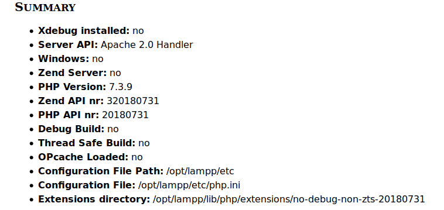

# Preparant l'entorn de desenvolupament

Per a poder provar els nostres llocs web necessitarem instal·lar una
sèrie d'eines com són: el servidor web Apache, el mòdul PHP per a
aquest servidor, el SGBD MySql, un front-end per al SGBD (PHPMyAdmin),
etc.

Per simplificar les coses optarem per instal·lar-ho mitjançant XAMPP, un
paquet de programari lliure que conté el servidor HTTP Apache, la base
de dades de MySQL i eines necessàries per utilitzar el PHP i el
llenguatge de programació Perl.

## Eines de desevolupament

Per a programar en llenguatges encastats com PHP, ASP o Phython és
suficient amb un editor de text pla. No obstant sempre és recomanable
treballar en un entorn integrat de desenvolupament o IDE (acrònim en
anglès de _Integrated development environment_). Un IDE és una eina
informàtica per al desenvolupament de programari de manera còmoda i
ràpida. Així doncs és un entorn de desenvolupament que agrupa diferents
funcions en un sol programa, habitualment: editor de codi, compilador,
depurador i un programa de disseny d'interfície gràfica.

El principal avantatge és que facilita la tasca del programador mentre
que l'inconvenient més important és que pot provocar mals hàbits a
l'hora de programar o provocar errors que a priori començant de zero no
es produirien.

Alguns dels IDE més emprats per al desenvolupament web són:

- Eclipse
- Netbeans
- Atom
- Sublime
- PHPStorm
- Brackets

Durant les activitats anteriors has preparat el teu propi entorn de
desenvolupament sobre una màquina virtual (o una real) tal com s'ha
explicat en les anotacions. Després, has de crear un projecte php
utilitzant PHPStorm i visualitzar la pàgina principal a través del teu
servidor XAMPP.

Al llarg del curs, crearem els nostres projectes utilitzant l'IDE PHPStorm.

Aquesta eina és de pagament, però podem utilitzar-la de forma gratuïta per a projectes OpenSource i amb finalitats educatives. En aqueixos
casos caldrà sol·licitar la llicència corresponent al fabricant del programari. Una vegada obtinguda la llicència educativa pel professor,
serà renovable anualment i podran utilitzar-la tots els alumnes del curs. És una eina molt completa que ens permetrà la integració amb
moltes de les funcionalitats que emprarem.


## Instal·lació de l'entorn de desenvolupament LAMP
  
1.  Descarrega el paquet XAMPP que continga la versió de PHP en la que anem a treballar durant el curs per a la nostra màquina
    (<https://www.apachefriends.org/>).
2.  Dona-li permisos d'execució al fitxer descarregat:
    `sudo chmod +x xampp-linux-x64-X.X.X-X-installer.run`
3.  Executem l'assistent d'instal·lació
    `sudo ./xampp-linux-x64-X.X.X.-X-installer.run`
4.  En l'assistent d'instal·lació, deixarem les opcions per defecte
    (excepte la qual ens parla de bitnami que la desmarcarem).
5.  Una vegada finalitzada la instal·lació, el nostre XAMPP es trobarà
    en el directori `/opt/lampp`
6.  Ara ja pots arrancar els serveis amb la següent ordre:
    `sudo /opt/lampp/lampp start`
7.  Quan els arranques, si obris el navegador i ens anem a la url
    <http://localhost>, ens hauria d'aparèixer la pàgina de benvinguda de
    XAMPP.
8.  Per a parar els serveis podem fer açò:
    `sudo /opt/lampp/xampp stop`
9.  En qualsevol cas, és molt més còmode treballar amb el panell de
    control de XAMPP que podrem executar amb la següent ordre:
    `sudo /opt/lampp/manager-linux-x64.run`
10. Veurem que s'inicia l'aplicació que ens permet controlar els
    serveis de XAMPP.
<figure markdown>

![[*Panell de control de
XAMPP*]{.title}](assets/Captura_de_pantalla_a_2019-09-13_21-03-02.png "Panell de control de XAMPP")
<figcaption>Panell de control de
XAMPP</figcaption>
</figure>


### Instal·lar PHPStorm

Per a instal·lar l'IDE PHPStorm seguirem els següents passos:

1. Executarem
    `sudo snap install phpstorm --classic`
2. Ens demanarà si volem importar dades d'una instal·lació anterior,
    al que contestarem, òbviament, que no.
3. Ens demanarà que acceptem la política de privadesa.
4. En executar l'aplicació per primera vegada ens demanarà les dades
    de llicència. Cada alumne s'haurà de registrar utilitzant l'enllaç
    que us passarà el professor en classe. en prémer l'enllaç ens
    redirigirà a la pàgina web de jetbrains perquè ens registrem. Una
    vegada registrats, podrem accedir a l'aplicació amb el nostre
    compte o amb el codi d'activació que ens proporcionen.
5. Finalment, indicarem la configuració inicial.

### Creació de projectes i comprovació de la instal·lació de PHP

Seguirem els passos que s'indiquen a continuació:

1. Arrancar XAMPP
2. Iniciar el mòdul Apache
3. Executar PHPStorm
4. Crear un projecte buit amb `Create New > Project PHP Empty Project`
5. Posar al projecte el nom `practica1` i situar-lo en el directori
    `/opt/lampp/htdocs` . Amb açò es crea un directori de nom `practica1` dintre de `/opt/lampp/htdocs`.

    

6. En la finestra de l'esquerra (explorador de projectes) apareix el projecte creat. Dins d'ell crearem un nou fitxer PHP prement botó dret sobre el nom i seleccionant `New > PHP File` . Li posem de nom `index.php` .

7. En el fitxer creat introduïm les següents línies de codi:

```php
<!doctype html>
<html lang="es">
    <head>
        <meta charset="utf-8">
        <title>Desenvolupament web en entorn servidor</title>
        <meta name="description" content="PHP, PHPStorm">
        <meta name="author" content="Homer Simpson">
    </head>
    <body>
        <?php
            phpinfo();
        ?>
    </body>
</html>
```

8. Canviem l'autor del document al nostre nom.

9.  Obrim el navegador i teclegem en la barra d'adreces la url:
<http://localhost/practica1>

10.  Apareixerà una pàgina similar a la de la següent imatge:
    


### Integrant l'executable de PHP

PHPStorm disposa d'ajuda intel·ligent (IntelliJ IDEA). Perquè aquesta
ajuda es corresponga amb la versió de php que tenim en el nostre XAMPP
haurem de registrar l'executable de PHP de XAMPP en el nostre PHPStorm.

Per a açò seguirem els següents passos:

1. En la pantalla d'inici anem a `Configure – Settings`.
2. En la llista de categories de l'esquerra anem a
    `Language & Frameworks - PHP`.
3. Necessitem indicar quin és el nostre intèrpret. ja que la llista
    està buida anem a configurar un de la següent forma:
    1. Fem clic en el botó `...` de la llista d'intèrprets
    2. Premem el botó + de la cantonada superior esquerra per a
        afegir-ne un.
    3. Li posem el nom PHP de XAMPP.
    4. Indiquem instal·lat on nostre està XAMPP: `/opt/lampp/bin/php`
    5. Immediatament ens indicarà la versió de l'intèrpret que tenim
        instal·lat
    6. Premem OK i seleccionem el nou interprete en la llista
        d'intèrprets.
    7. Finalment, seleccionem en l'opció PHP _language level_ aquell
        que es corresponga amb l'intèrpret que acabem de configurar.
    8. Ara el nostre PHPStorm farà ús del PHP de XAMPP i utilitzarà la
        versió de PHP que tenim instal·lada quan ens oferisca les
        ajudes.
    9. Primer projecte amb PHPStorm Per a començar a treballar amb
        PHPStorm anem a crear el nostre primer projecte PHP buit.
        Tingueu en compte que el projecte heu de crear-ho en el
        directori `/opt/lampp/htdocs` i que necessitem tenir permisos
        d'escriptura en aquest directori.

**Compte!** Pot ser que ho hàgem instal·lat com `root`, mentre que quan
executem PHPStorm ho fem amb l'usuari `dwes`, per tant, l'usuari
`dwes` necessita poder escriure en aquest directori.

Per a assegurar-nos que tenim permisos, anirem amb una finestra de
terminal al directori `/opt/lampp` i executarem la següent ordre:

```shell
ls –la htdocs
```

Aquesta ordre ens dirà qui és el propietari de la carpeta i quins
permisos té.

En el cas que el propietari siga root executarem la seguent ordre:

```shell
sudo chown -hR dwes htdocs/
```

Açò canviarà el propietari a l'usuari `dwes`, amb el que tindrem permís
d'escriptura en aquest directori des de PHPStorm.

Treballarem tenint els projectes en la mateixa carpeta.

## Eines per a la depuració de codi

En els entorns de desevolupament és necessari disposar de ferramentes que ens
permenten depurar les nostres aplicacions. Ja siga per arreglar errors com per
millorar l'execució del codi.

Els entorns de desevolupament d'aplicacions d'escriptori solen disposar dels seus
propis sistemes de depuració, en el cas dels llenguatges d'entorn servidor alguns ecosistemes
  com el de .Net de Microsoft l'inclouen. Per a PHP hi ha diverses ferramentes com  XDebug o DBG.

### Instal·lació d'XDEBUG 3.0

!!!warning "XDebug 3.0"
    Recentment s'ha publicat XDebug 3.0, versió que cobreix aquest document. Si busqueu informació, tingau en compte en quina versió treballeu.

A continuació, explicarem com instal·lar el mòdul XDebug 3 en un entorn basat en XAMPP. Abans de res comprovarem que no el tenim
instal·lat, per a això seguirem els següents passos:

1. Obrim la pàgina de benvinguda de XAMPP escrivint al navegador la URL
[http://localhost](http://localhost).

2. A la part superior de la pàgina tenim una sèrie d'enllaços, entre
els que es troba un que diu `phpinfo`. Feu clic en aquest enllaç.

3. Se'ns mostrarà la pàgina de configuració del nostre mòdul php. Anem
a seleccionar tots els continguts d'aquesta pàgina i els anem a copiar.

4. Obrirem al navegador la següent URL: <http://xdebug.org/wizard.php>.

5. En aquesta pàgina podrem comprovar quins mòduls tenim instal·lats en
nostre mòdul PHP. Per a això, enganxarem els continguts que hem copiat
prèviament a la caixa de text que apareix i premerem `Analyse
mi phpinfo() output`.

6. Ens apareixeran un resultats semblants a aquests:



Com es pot observar, l'extensió XDebug no està instal·lada.

Una altra informació important que ens dóna és que el nostre fitxer de
configuració del PHP el podem trobar en `/opt/lampp/etc/php.ini` i les
extensions les tenim en
`/opt/lampp/lib/php/extensions/no-debug-non-zts-20180731`

_És important que recordem aquestes dades._

Per instal·lar l'extensió XDebug seguirem les instruccions que ens
indica la pàgina anterior però compte perquè cal fer algunes
modificacions:

!!! important
    Els caràcters `#` representen valors que depenen de cada instal·lació, així que cal tindre-ho en compte en executar-ho.

1. Descarregueu [la darrera versió d'Xdebug](https://xdebug.org/download)
2. Instal·leu els requisits previs per a la compilació d'extensions
    PHP.\
    Instal·leu-lo amb el sistema Ubuntu amb:
    `apt-get install php-dev autoconf automake`
3. Desempaqueteu el fitxer descarregat amb `tar -xvzf xdebug-#.#.#.tgz`
4. Executar: `cd xdebug-#.#.#`
5. Executar: `/opt/lampp/bin/phpize` (hem canviat la ruta perquè
    execute el phpize de XAMPP).

    Com a part de la seva eixida hauria de mostrar:

        Configuring for:
        ...
        Zend Module Api No: ########
        Zend Extension Api No: #########

    Si no és així, estàs utilitzant phpize incorrecta. Seguiu aquesta
    entrada de FAQ i passeu al pas següent.

6. Executar: `./configure --with-php-config=/opt/lampp/bin/php-config`
    (hem afegit la ruta del php-config de XAMPP).
7. Compilem les fonts: `make`
8. Executar:
    `sudo cp modules/xdebug.so /opt/lampp/lib/php/extensions/no-debug-non-zts-########`
9. Edita `/opt/lampp/etc/php.ini` i afegeix les següents línies al
    final

        [xdebug]
        zend_extension=xdebug

10. Reinicieu el servidor web

Repeteix els passos del 1 al 5 inicials per comprovar que XDebug sí està
instal·lat.

.png)

Després caldrà configurar PHPStorm per a connectar-lo a XDebug [Integració amb PHPStorm](https://www.jetbrains.com/help/phpstorm/configuring-xdebug.html#integrationWithProduct) i instal·lar una extensió de Firefox [Xdebug Helper](https://addons.mozilla.org/ca/firefox/addon/xdebug-helper-for-firefox/?src=search) o Chrome.
