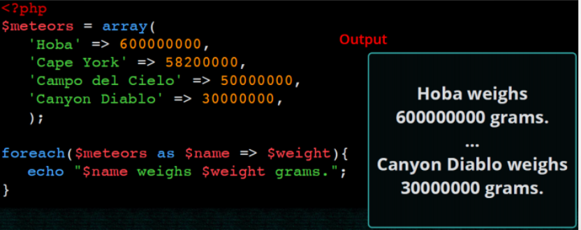

# El llenguatge PHP

!!! important "Objectius"
    * Conèixer la sintaxi bàsica de PHP i les noves característiques de PHP 8.
    * Entendre com s'integren PHP i HTML.
    * Descriure els tipus de dades existents en PHP.
    * Fer servir les estructures de control bàsiques.
    * Aprendre a utilitzar els _arrays_ associatius.
    * Conèixer els mecanismes de pas de paràmetres a un script.
    * Processar i validar formularis
    * Incloure fitxers

## Introducció

* Acrònim de _Personal Home Page_
* Llenguatge de propòsit general, encara que el seu fort és el desenvolupament web.
* Sintaxi similar a C/Java
* El codi s'executa en el servidor (en Apache mitjançant _mod_php_)
* El client rep el resultat generat després d'interpretar el codi al servidor.
* El codi s'emmagatzema en arxiu amb extensió `.php.`

L'última versió és la 8.1, de novembre de 2021 (i en breu tindrem la versió 8.2). La versió 7.0 va sortir al desembre de 2015. A més de nombroses noves funcionalitats que anirem veient durant el curs, té més de dues vegades millor rendiment que PHP5. 

!!! important "PHP 8.1"
    Nosaltres farem ús de la versió 8.1 de PHP

La seva documentació és extensa i està traduïda: https://www.php.net/manual/es/. 

## Funcionament i estructura bàsica

### El nostre primer codi PHP 

* El codi PHP sempre va entre els simbolos `<?php` i `?>`.
* Les instruccions PHP acaben sempre amb `;`.

```html+php
<!DOCTYPE html>
<html lang="ca">
  <head>
    <meta charset="UTF-8">
    <title>PHP fàcil</title>
  </head>
  <body>
  <!-- Mostra una frase en HTML -->
    Hola món!<br>
  <!-- Mostra una frase en PHP -->
  <?php echo "És molt fàcil programar en PHP."; ?>
  </body>
</html>
```


* Per a generar codi HTML des de PHP podem utilitzar diversos mètodes:  
    - `echo expressió` 
    - `print (expressió)`
    - `<?= expressió ?>`
* El codi pot anar entre les etiquetes d'HTML.

```html+php
<html>
<head></head>
<body>
	<h1><?php echo "Hola món" ?></h1>
<body>
```

```html+php
<html>
<head></head>
<body>
	<h1><?= "Hola món" ?></h1>
<body>
```

### Comentaris

* De bloc entre `/*` i `*/`.
* De linea, començant per `//` o per `#`.

### Variables i tipus de dades

Una de les característiques de PHP és que és un llenguatge **no fortament tipat** (com Javascript). 
De fet, no cal declarar la variable ni indicar el tipus de dades si la declare. 
Encara que si volem codi de qualitat ho hauriem de fer.

#### Declaració 

* Els noms de les variables sempre comencen per `$` 
* Després del `$` els noms de les variables han d'anar seguits per una lletra o el caràcter `_` i poden contenir també números. 
* No és necessari declarar una variable ni especificar-li un tipus (enter, cadena,...) concret.
* Les variables són _case sensitive_: `$var != $vAR`.

Per crear una variable que continga el text a generar i mostrar-la:

```html+php
<html>
<head></head>
<body>
	<h1>
	<?php 
		$salutacio = "Hola món";
		echo $salutacio; 
	?>
	</h1>
<body>
```

#### Tipus de les variables

* El tipus de la variable es decideix en funció del context en què s'utilitze.
* En assignar-li el valor 7, la variable és de tipus “sencer” 

```php
$la_meua_variable = 7;  // ara és un número
$la_meua_variable = "set"; // ara és cadena
```

Si li canviem el contingut passa a ser de tipus “cadena”

!!! warning "Variable no inicialitzades"
    Si s'intenta utilitzar una variable abans d'assignar-li un valor, es genera un error de tipus **E_NOTICE** però no s'interromp l'execució de l'script. L'eixida mostrarà un avís cada volta que s'intente.
 
#### Tipus de dades en PHP

* booleà (**boolean**). Els seus possibles valors són `true` i `false`. A més, qualsevol nombre enter es considera com `true`, excepte el 0 que és `false`.
* enters (**integer**). Qualsevol nombre sense decimals. Es poden representar en format decimal, octal (començant per un 0), o hexadecimal (començant per 0x).
* real (**float**). Qualsevol nombre amb decimals. Es poden representar també en notació científica.
* cadena (**string**). Conjunts de caràcters delimitats per cometes simples o dobles.
* vector (**array**). Conjunt de variables del mateix tipus ordenades.
* Objecte (**object**). Utilitzat per les instàncies de classes.
* **null**. És un tipus de dades especial, que s'usa per a indicar que la variable no té valor. (<http://php.net/manual/es/language.types.null.php>)

!!! danger "Valors que s'avaluen a `false`"
    Quan es realitzen operacions que s'avaluen com a booleà els següents valors s'avaluaran a `false`:    
      
       - els enters 0 i -0 (zero).
       - els reals `0.0` y `-0.0` (zero).
       - la cadena buida i la cadena `"0"`.
       - un _array_ amb zero elements.
       - el tipus especial NULL (incloses les variables no inicialitzades). 


#### Àmbit de les variables

L'àmbit d'una variable indica quina és la part del codi en què la variable esmentada és accessible. 

Una variable declarada en un fitxer de PHP està disponible en aqueix fitxer i en els que incloguen. 

Les funcions defineixen un àmbit local, separat de la resta del codi. No obstant això, es poden 
definir variables globals amb la paraula reservada **global**, encara que no són aconsellables.

```php
$a = 1; /* global scope */ 

function test()
{ 
    echo $a; /* reference to local scope variable */ 
} 

test(); // ""


function test2()
{ 
    global $a;  /* reference to global scope variable */ 
    echo $a; 
} 

test2(); // 1
```

### Constants

Per a definir constants s'utilitza `define()`, que reb el nom de la constant i el valor que li volem donar. També
podem user la paraula reservada `const`.

```php
const PI = 3.1415927
define("PI", 3.1415927)
```

!!! info "Constants sempre en majúscules"
    És una convenció utilitzar identificadors en majúscules per a les constants.

### Operadors  

#### Arimètics

| Exemple | Nom | Resultat
| ---   | ---   | ---
| `+$a` | Identidat | Conversió de `$a` a `int` o `float` segons el cas.
| `-$a` | Negació | Oposat de `$a`.
| `$a + $b` | Suma | Suma de `$a` i `$b`.
| `$a - $b` | Resta | Diferència de `$a` i `$b`.
| `$a * $b` | Multiplicació | Producte de `$a` i `$b`.
| `$a / $b` | Divisió | Quocient de `$a` i `$b`.
| `$a % $b` | Módul / Residu | Residu de `$a` dividit per `$b`.
| `$a ** $b` | Potència | Resultat de `$a` elevat a `$b`. PHP >= 5.6.

En el caso de **cadenas**, si queremos concatenarlas, se utiliza el operador `.`:

```php
$x = 33;
$y = 11;
$z = $x + $y;
echo "La suma de 33 y 11 es ".44."<br />";
echo "La suma de ".$x." y ".$y." es ".(33 + 11)."<br />";
echo "La suma de ".$x." y ".$y." es ".$z."<br />";
```

Realment en lloc de concatenar cadenas con variables, podem imprimir-les directament 
ja que s'expandeixen automàticament:

``` php
echo "La suma de $x y $y es $z <br />";
```

A vegades, necessitem envoltar el nom de la variable entre claus per poder un més text al resultat:

``` php
$color = "rojo";
echo "El plural de $color el ${color}s";
?>
```

Més endavant estudiarem algunes funcions per al tractament de cadenes.

#### Comparació

| Exemple | Nom | Resultat
| ---   | ---   | ---
| `$a == $b` | Igual | `true` si `$a` és igual a `$b` després de la conversió de tipus.
| `$a === $b` | Idèntic, Comparació estricta | `true` si `$a` és igual a `$b`, i són del mateix tipus de dada.
| `$a != $b`, `$a <> $b` | Diferent |`true` si `$a` no és igual a `$b` després de la conversió de tipus.
| `$a !== $b` | No idèntic |`true` si `$a` no és igual a `$b`, o si no són del mateix tipus.
| `$a < $b` | Menor que |`true` si `$a` és estrictament menor que `$b`.
| `$a > $b` | Major que |`true` si `$a` és estrictament major que `$b`.
| `$a <= $b` | Menor o igual que |`true` si `$a` és menor o igual que `$b`.
| `$a >= $b` | Major o igual que |`true` si `$a` és major o igual que `$b`.
| `$a <=> $b` | Nau espacial | Torna `-1`, `0` o `1` quan `$a` és respectivamente menor, igual, o major que `$b`. PHP >= 7.
| `$a ?? $b ?? $c` | Fusión de *null* | El primer operano d'esquerra a dreta que existisca i no siga `null`. `null` si no hi ha valors definits i no són `null`. PHP >= 7.

#### Lògics

| Exemple | Nom | Resultat
| ---   | ---   | ---
| `$a and $b`, `$a && $b` | *And* (i) | `true` si tant `$a` com `$b` són `true`.
| `$a or $b`, `$a || $b`| *Or* (o inclusiu) | `true` si qualsevol de `$a` o `$b` és `true`.
| `$a xor $b` | *Xor* (o exclusiu) | `true` si `$a` o `$b` és `true`, pero no ambdós.
| `!$a` | *Not* (no) | `true` si `$a` no és `true`.

#### Assignació

| Exemple | Nom | Resultat
| ---   | ---   | ---
| `$a = $b` | Assignació | Assigna a `$a` el valor de `$b`
| `$a += $b` | Assignació de la suma | Le suma a `$a` el valor de `$b`. Equivalent a `$a = $a + $b`
| `$a -= $b` | Assignació de la resta | Le resta a `$a` el valor de `$b`. Equivalent a `$a = $a - $b`
| `$a *= $b` | Assignació del producte | Assigna a `$a` el producto de `$a` por `$b`. Equivalent a `$a = $a * $b`
| `$a /= $b` | Assignació de la divisió | Assigna a `$a` el quocient de `$a` entre `$b`. Equivalent a `$a = $a / $b`
| `$a %= $b` | Assignació del residu | Assigna a `$a` el residu de dividir `$a` entre `$b`. Equivalent a `$a = $a % $b`
| `$a .= $b` | Concatenació | Concatena a `$a` la cadena `$b`. Equivalent a `$a = $a . $b`
| `$a++` | Increment | Incrementa `$a` en una unitat. Equivalent a `$a = $a + 1`
| `$a--` | Decrement | Decrementa `$a` en una unitat. Equivalent a `$a = $a - 1`

!!! Tip "Prioritat dels operadors"
    Recorda la prioritat. Primer els parèntesis, després la negació (`!`), productes/divisions, sumes/restes, comparacions, lògics i finalment es realitza l'assignació.
    Més informació a [https://www.php.net/manual/es/language.operators.precedence.php](https://www.php.net/manual/es/language.operators.precedence.php)

!!! question "Autoavaluació"
    Si `$a=5` i `$b=4`, esbrina el valor de `$c` si `$c = $a*2 > $b+5 && !($b<>4)`

## Treballant en formularis

Les dades s'envien via URL en el format `var1=valor1&var2=valor2….` Per exemple: `exemple.php?nom=Homer+cognom=Simpson`

Es divideix en dos passos:

  1. Genera un formulari amb l'atribut `action='file.php' method='GET'`.
  2. En el fitxer `.php` cal llegir les dades amb `$_GET['varName']`.

Anem a separar sempre que puguem el codi HTML del de PHP. Per exemple, el formulari el coloquem en `saluda.html`:

```html
<form action="saluda.php" method="get">
    <p><label for="nombre">Nombre: </label>
    <input type="text" name="nombre" id="nombre"></p>
    <p><label for="apellido1">Primer apellido:</label> 
    <input type="text" name="apellido1" id="apellido1"></p>
    <p><input type="submit" value="enviar"></p>
</form>
```
I recollim les dades en `saluda.php`:

```php
<?php
$nombre = $_GET["nombre"];
$apellido1 = $_GET["apellido1"];

echo "Hola $nombre $apellido1";
?>
```

Si volguéssim fer-ho tot en un únic fitxer (la qual cosa no es recomanable), podem fer-ho així:

```html+php
<form action="" method="get">
    <p><label for="nombre">Nombre: </label>
    <input type="text" name="nombre" id="nombre"></p>
    <p><label for="apellido1">Primer apellido:</label>
    <input type="text" name="apellido1" id="apellido1"></p>
    <input type="submit" value="enviar">
</form>
<p>
    <?php
    if(isset($_GET['nombre'])) {
        $nombre = $_GET["nombre"];
        $apellido1 = $_GET["apellido1"];

        echo "Hola $nombre $apellido1";
    }
    ?>
</p>
```
Més endavant aprofundirem en la gestió de formularis.

## Estructures de control de flux
* Les instruccions de control de flux en PHP funcionen exactament igual que en altres llenguatges de programació.

* Les més habituals són:

  * Condicionals: `if`, `if` `else`, `switch `
  * Bucles: `while`, `do` `while`, `for`

seguint les estructures:

```php
if (condició) {
	// instruccions
}
else {
	// instruccions
}
```
```php
switch ($variable) {
	case valor:
		//instruccio1
		break;
	case valor:
		//instruccio1
		break;
	default:
		//instruccio1
}			
```
```php
while (condició) {
	//instruccions
}
```
```php
do {
	//instruccions
} while (condició);
```
```php
for ($i=1;$i<10;$i++){
	//instruccions
}
```

<http://php.net/manual/es/language.control-structures.php>

## Maneig de cadenes de text 

* Podem utilitzar tant cometes simples com a cometes dobles.
* Per a concatenar cadenes utilitzarem l'operador punt (.)

```html+php
$fullName = $name.' '.$surname;
```

### Expansió de variables

* Podem introduir una variable dins d'un text sempre que usem les cometes dobles per a delimitar el text. Açò farà que el contingut de la variable s'expandisca i es concatene amb el text existent en la cadena.

```php
echo "<p>Mòdul: $module</p>"
```

* A voltes, és necessari envoltar-la entre claus

```php
echo "<p>Mòdul: {$module}DAW</p>"
```

* Si no posàrem les claus l'intèrpret cercaria una variable que es cride `$moduleDAW`


Més informació en [funcions de cadena](https://www.php.net/manual/es/ref.strings.php)

## Maneig de dates

### Funció `time()`

En PHP les dates s'emmagatzemen com a números enters. La funció `time()` retorna el nombre de segons transcorreguts 
des de l'1 de gener de 1970 (instant conegut com a època Unix). 
A aquesta forma d'expressar data i hora se li denomina **timestamp**.

### Funció `date()`

```php
date (string $format [, int $timestamp=time()]): string
```

La funció `date` retorna una cadena formatada segons els codi de format. Si no li passem la variable `timestamp` 
ens retorna la cadena formatada per a la data i l'hora actual.

Els codis de format més habituals  per a la funció `date` són:

|CODI|DESCRIPCIÓ|
|--- |--- |
|a|am o pm|
|A|AM o PM|
|d|Dia del mes amb zeros|
|D|Abreviatura del dia de la setmana (en anglès)|
|F|Nom del mes (en anglès)|
|h|Hora en format 1-12|
|H|Hora en format 0-23|
|i|Minuts|
|j|Dia del mes sense zeros|
|l|Dia de la setmana|
|m|Número de mes (1-12)|
|M|Abreviatura del mes (en anglès)|
|s|Segons|
|y|Any amb 2 dígits|
|Y|Any amb 4 dígits|
|z|Dia de l'any (1-365)|

La informació completa la pots trobar en el [manual oficial de PHP: date](https://www.php.net/manual/es/function.date.php)

Suposant que hui és 15 de setembre de 2019 i les 19 hores 20 minuts i 23 segons et mostrem alguns exemples:

```php
date("d-m-Y"); // 15-09-2019
date("H:i:s");  //  19:20:23
date("Y"); // 2019
date("YmdHis"); // 20190915192023
date("d/m/y H:i a"); // 15/09/19 19:20 pm
date("d-m-Y H:i", time()); // Moment actual
```
### Funció `mktime(hora, min, seg, mes, dia, any)`

La funció mktime permet obtenir la marca de temps Unix (_timestamp_) d'una data.

Per exemple:

```php
$data = mktime(0, 0, 0, 1, 1,2020);
echo date('d-m-Y', $data); // mostrarà 01-01-2020
```
Més informació en [https://www.php.net/manual/es/function.mktime.php](https://www.php.net/manual/es/function.mktime.php)

Una altra forma de crear dates és mitjançant la funció `strtotime()` on podem indicar les dates mitjançant una cadena de text. Per exemple:

```php
// posarem la data en el format any-mes-dia per a evitar confusions.
$date = strtotime("2020-01-01"); 
```

### Operar amb dates

Com hem dit al principi les dates s'emmagatzemen com a enters on cada unitat representa un segon. Així podem sumar i restar dates (_timestamp_) per a afegir, llevar o calcular diferències entre ells.

Per exemple, per poder determinar els dies que falten per a l'1 de gener de 2020 faríem:

```php

$data=mktime(0, 0, 0, 1, 1,2020); // timestamp que representa l'1 de gener de 2020
$diferencia=$data - time(); // restem a l'1 de gener de 2020 el temps actual, 
                                // el resultat estarà en segons.
$diferenciaEnDies =((( $diferencia / 60) / 60 ) / 24 );
/*  
    dividim els segons entre 60 i obtenim els minuts,
    els dividim entre 60 i obtenim les hores,
    els dividim entre 24 i obtenim els dies 
*/
```

### Validar dates

En la funció `checkdate` podem validar una data.

```php
checkdate (int $month, int $day ,int $year): bool
```
La funció torna `true` si la data es vàlida, si no, torna  `false`. 

### Classe DateTime

PHP disposa també de la classe `DateTime` per a representar les dates, la veurem més avant.


## Maneig d'arrays

Un array és un tipus de dades que ens permet emmagatzemar diversos valors. Per tal d'accedir a un valor utilitzarem una *clau*. Les claus poden ser nombres o textos (*arrays associatius*). Si no indiquem cap clau, a cada element se li associarà una clau numèrica correlativa.

### Array indexat

#### Crear array

* Podem crear un array buit de dues formes:

```php
$noms = array();
$noms = [];
``` 

* Si volem assignar valors al array en el moment de crear-ho: 

```php
$noms = array('Sandra', 'Pedro', 'Andrea'); 
$noms = ['Sandra', 'Pedro', 'Andrea'];
```

#### Mostrar el contingut d'un array

Si intentem mostrar el contingut d'un array amb **echo** no obtindrem  les dades que hi ha dins del array. En lloc d'açò podem utilitzar la funció print_r: 

```php
print_r($noms);
```

Però si necessitem donar-li format als continguts del array, haurem de recórrer-ho amb un bucle i anar mostrant element a element.

#### Afegint elements al array

Podem afegir elements al array utilitzant claudàtors buits. La clau d'aquests elements serà el següent índex numèric disponible.

```php
$noms[]='Raul'; $noms[]='Marta';
```

#### Accedir als elements del array

Accedirem als elements del array indicant la clau de l'element entre claudàtors:

```php
echo $noms[2];
```

 També podem modificar el seu valor:

```php
$noms[0] = 'Sara';
```
#### Recórrer arrays


### Arrays associatius

Si el array conté dades diverses i/o ens interessa accedir a ells amb claus més específiques que un simple índex numèric podem utilitzar arrays associatius: 

```php
$alumne = array('nom' => 'Sara', 'cognom' => 'García', 'edat' => 22 );
$alumne = ['nom' => 'Sara', 'cognom' => 'García', 'edat' => 22 ];
$alumne['nom'] = 'Verónica';
echo $alumne['nom'];
```
#### Recórrer arrays associatius


#### Recórrer claus i valors



### Arrays multidimensionals
Imagina que volem tenir un array els elements del qual són noms d'esports. Volem dividir-los en esports d'hivern i esports d'estiu. Podem crear un array esports que continga dos elements que al seu torn també seran arrays.

```php
$esports = ['hivern' => ['esquí de fons', 'hoquei sobre gel'], 'estiu' => [ 'natació', 'voley platja'] ];
```

Per a accedir al primer esport d'hivern:

```php
echo $esports['hivern'][0];
```

### Funcions d'arrays

Podem obtenir la mida de l'array mitjançant la funció `count(array)`. 
Per recórrer l'array farem ús d'un bucle `for`:

```html+php
$tam = count($fruites); // mida de l'array
for ($i=0; $i<count($fruites); $i++) {
   echo "Element $ i: $ fruites [$ i] <br />";
}
```

Les operacions més importants que podem realitzar amb _arrays_ són:

* `print_r($ array)`: mostra el contingut de tot el `$array`
* `$elem = array_pop($array)`: elimina l'últim `$element`
* `array_push ($ array, $ elem)`: afegeix un `$element` al final.
* `$bool = in_array($elem, $array)`: esbrina si `$elem` està en el`$array`

=== "PHP"

    ```php    
    $fruits = [ "orange", "pear", "apple"];

    array_push ($fruites, "pinapple");
    print_r($fruits);

    $lastFruit = array_pop($fruits);
    if (in_array("pineapple", $fruits)) {
        echo "<p> Pineapple left </ p>";
    } else {
        echo "<p> No pineapple left </ p>";
    }
    print_r($fruites);
    ?>
    ```

=== "Consola"

    ```Console
    Array
    (
      [0] => orange
      [1] => pear
      [2] => apple
      [3] => pinapple
    )
    <p>No pineapple left</ p>
    Array
    (
      [0] => orange
      [1] => pear
      [2] => apple
    )
    ```

* `$claus = array_keys($array)`: torna les claus de l'`$ array` associatiu.
* `$tam = count ($array)`: retorna la mida de `$ array`.
* `sort($array)`: ordena els elements de l' `$ array`.
* `isset($array[element])`: indica si existeix / té valor element dins del array.
* `unset($array[element])`: elimina l'element de l'array (deixa un buit).

=== "PHP"

    ```php
    $capitals = array ("Italy" => "Rome",
      "France" => "Paris",
      "Portugal" => "Lisbon");

    $countries = array_keys($capitals);
    print_r($countries);
    sort($countries);
    print_r($countries);
    
    unset($capitals["France"]);
    print_r($capitals);
    ```
=== "Consola"
    ```Console
    Array
    (
      [0] => Italy
      [1] => France
      [2] => Portugal
    )
    Array
    (
      [0] => France
      [1] => Italy
      [2] => Portugal
    )
    Array
    (
      [Italy] => Rome
      [Portugal] => Lisbon
    )
    ```

Existeixen moltíssimes més funcions per treballar amb arrays. Tota la informació en el [documentació oficial](https://www.php.net/manual/es/ref.array.php).

!!! tip "Articles per aprofundir en les operacions amb arrays"
    * Un article molt complet (en anglès) de [Com treballar amb arrays en PHP de la manera correcta](https://code.tutsplus.com/tutorials/working-with-php-arrays-in-the-right-way--cms-28606).
    * Un altre article recomanable (en anglès) és [Com ordenar arrays en PHP](https://code.tutsplus.com/tutorials/wow-to-sort-arrays-in-php--cms-32313).

Altres recursos: 

* [https://www.studytonight.com/php/indexed-array](https://www.studytonight.com/php/indexed-array)
* [https://aprende-web.net/php/php6_1.php](https://aprende-web.net/php/php6_1.php)

## Funcions

### Funcions predefinides

Algunes de les funcions predefinides en PHP són les següents, però hi ha moltíssimes més 
vinculades als diferents mòduls que podem instal·lar.

* `is_null($var)` determina si una variable és nula o no.
* `isset($var)` determina si una variable estan definida i no és NULL.
* `unset($var)` destrueix les variables especificades.
* `empty($var)` torna **true** si no existeix o és **FALSE**
* `is_int($var)`, **is_float()**, **is_bool()**, **is_array()**
* `var_dump($var)`, mostra informació de la variable.

### Funcions definides per l'usuari

Per a crear les teues pròpies funcions, hauràs d'usar la paraula **function**:

```php
function suma($a, $b) { 
	return $a + $b; 
}
```

Per tal d'invocar la funció:

```php
$resultat = suma(5, 7);
```
Si una funció no té una sentència **return**, retorna **null** en finalitzar.

!!! important "Command-query separation"
    Sí bé és un principi de la programació orientada a objectes és útil usar-lo també quan definim funcions. El principi afirma que cada mètode ha de ser un comandament que realitza una acció o una consulta que retorna dades al que la crida, pero no ambdues coses.

### Valors per defecte en els paràmetres

Podem indicar valors per defecte per als paràmetres. Si quan cridem a la funció no indiquem el valor d'un paràmetre es prendrà el valor per defecte indicat.

```php
function preuAmbIva($preu, $iva=0.21){
	return $preu * (1 + $iva);
}
$preu = 10;
$pIva = preuAmbIva($preu);
```

* Pot haver-hi més d'un paràmetre amb valor per defecte, però sempre han d'estar al final.

### Pas de paràmetres per referència

Per defecte els paràmetres es passen per valor. Per a passar un paràmetre per referència afegirem el símbol **&** davant del seu nom.

```php
function preuAmbIva(&$preu, $iva=0.18){
	$preu *= (1 + $iva);
}
```

### Paràmetres per nom

Des de PHP 8.0 podem passar els arguments amb el nom (a més de per posició, com hem fet fins ara). Els arguments amb nom es passen posant el nom com a prefix del paràmetres separat per dos punts `:` `$resultat=funcio(arg1: valor1, arg2: valor2);`

Aquesta característica complementa els paràmetres opcionals permetent-nos saltar-ne el valor:

```php
function funcionArgumentsNom($a, $b = 2, $c = 4) {
   echo "$a $b $c";
}
funcionArgumentsNom(c: 3, a: 1); // "1 2 3"
```

Tant els paràmetres opcionals com els obligatoris poden tenir nom, però els arguments amb nom s'han de posar després dels que no en tenen.

```php
funcioArgumentsNom(1, c: 3); // "1 2 3"
```

### Declaracions de tipus (_Type Hinting_)

Des de PHP 7.0 les funcions poden definir tipus tant per als paràmetres com als valors de retorn. Si el valor donat és d'un tipus incorrecte, es generarà un error. Per això s'ha d'anteposar-se el nom del tipus al nom del paràmetre. Es pot fer que una declaració accepte valors **NULL** si el valor predeterminat del paràmetre s'estableix a NULL.

Per a aconseguir este comportament caldrà afegit la següent directiva:

```php
<?php
declare(strict_types=1);
```

Si una funció no torna res s'indica mitjançant el tipus `void`.

#### Tipus vàlids
| Type | Description | Version |
|:---:|:---:|:---:|
|Class/interface name |The value must be an instanceof the given class or interface. ||
|self|The value must be an instanceof the same class as the one in which the type declaration is used. Can only be used in classes.||
|parent|The value must be an instanceof the parent of the class in which the type declaration is used. Can only be used in classes.||
|array|The value must be an array.||
|callable|The value must be a valid callable. Cannot be used as a class property type declaration.||
|bool|The value must be a boolean value.||
|float|The value must be a floating point number.||
|int|The value must be an integer.||
|string|The value must be a string.||
|iterable|The value must be either an array or an instanceof Traversable.| PHP 7.1.0 |
|object|The value must be an object.|PHP 7.2.0|
|mixed|The value can be any value.|PHP 8.0.0|

#### Exemple

```php
declare(strict_types=1);

function suma(int a, int b):int
{
	return $a + $b;
}
$num=25

echo suma(3,5); // 8
echo suma(3, $num); // 28
echo suma("3",5 ) // error ja que s'aplica el tipat estricte
```

### Àmbit (_scope_) de les variables

L'àmbit d'una variable és el context dins el qual la variable està definida. La major part de les variables PHP només tenen un àmbit simple.

Les **variables globals** són accessibles des de qualsevol part del programa.

Qualsevol variable usada dins d’una funció está, per defecte, limitada a l'àmbit local de la funció.

`test()` no imprimirà res ja que els àmbits de les variables és distint.

```php
$a = 1 /* àmbit global */

function test() {
  echo $a;
}
test();
```


La paraula reservada `global` permet accedir a les varibles globals dintre d’una funció.

```php
$a = 1 /* àmbit global */

function test() {
  global $a
  echo $a; 
}

test(); // 1
```

!!! important "Evita l'ús de variables globals"
    Les variables globals es poden alterar per qualsevol part del codi, la qual cosa fa que siga difícil de recordar o raonar sobre cada ús possible. Una variable global no pot tenir control d'accés. No es pot limitar a algunes parts del programa. L'ús de variables globals provoca un acoblament molt estret del codi. 


### Funcions com a paràmetres

En PHP és possible passar funcions com a paràmetres a altres funcions. Només cal passar el nom de la funció entre cometes. 

Exemple:

```php
function calculator($operation,$numA,$numB){
	return $operation($numA,$numB); 
}
function sumar($a,$b) { return $a+$b; }
function restar($a,$b) {return $a-$b; }

$a=4;$b=6;
echo calculator('sumar',$a,$b); // 10
echo calculator('restar',$a,$b); // -1
```

### Funcions anònimes (**closures**)

Los funcions anònimes estan implementades usant la classe **Closure**. Permeten la creació de funcions que **no tenen un nom específic**. Podem assignar una funció anònima a una variable o passar-la com a paràmetre a una altra funció.

Exemple:
  
Sense paràmetres:

```php
$anonima = function () {
	echo "Hola"; 
}; 
$anonima(); // Hola
```

Amb paràmetres:

```php
$anonima = function ($nom) {
	echo "Hola {$nom}"; 
}; 
$anonima('Vicent'); // Hola Vicent
```

#### Usar variables de l'àmbit superior

* Una funció anònima pot usar variables de l'àmbit superior mitjançant la paraula reservada **use**: 

```php
function saluda(callable $fnSaluda) {
	$fnSaluda('Vicent'); 
} 
$salutacio = 'Hola'; 
$anonima = function ($nom) use ($salutacio) {
	echo "{$salutacio} {$nom}"; 
}; 
saluda($anonima);
```
#### Llibreries

Podem fer llibreries de funcions guardant-les en un fitxer que desprès importem des d'on les utilitzem. Ho podem fer amb include, o utilitzant composer per a fer-ho.


## Sentències per a incloure Fitxers

Les sentències `include()` i `include_once()` i `require()` i `require_once()` inclouen i avaluen el fitxeru especificat. 

`include_once()` i `require_once()` a més verifique que el fitxer no haja sigut inclòs abans i és preferible a `include`. Cal ser curòs amb el `path` del fitxer a incloure. 

La diferència entre `require` i `include` és el tractament de l'error quan el fitxer no existeix. Mentre `include` mostra un avís, `require` mostra una error fatal que para l'execució de l'script.

!!! info "Vistes"
    Un ús habitual de les funcions d'inclusió és crear vistes. Una vista és la part de l'aplicació que mostra la informació a l'usuari. Amb les inclusions podem separar la part de lògica de la d'interfície d'usuari.

### Àmbit de les variables
Com s'observa en l'exemple següent, les variables creades abans de cridar l'include, estaran disponibles en el fitxer inclòs. 

És a dir, com si tot fora un únic document.


=== "fruits.php"

```php
<?php
$color = 'green';
$fruit = 'apple';
include 'fruit.view.php'
```
=== "fruits.view.php"

```html+php
<html>
<head>
<title>Fruites</title>
</head>
<body>
	<h3>
 		<?= "A $color $fruit" ?> 
 	</h3>		
</body>
</html>
```

### Rutes
En l'exemple anterior `include "fruit.view.php"` la ruta s'especifica de forma relativa, és a dir, la ruta es calcularà a 
partir de la ruta en que s'execute el fitxer principal. A mesura que les aplicacions van creixent aquest tipus de rutes acaben sent un mal de cap.
Per això és recomanable escriure les inclusions de forma relativa però fixant prèviament el directori actual.

```php
require __DIR__ . '/fruits.view.php';

```


## Noves caracterísques PHP 

### Spaceship operator  (<==>)
Compara dues expressions $a i $b i torna -1 si $a és menor que $b, 0 si són iguals i 1 si $b és major que $a.

Exemple:

```php
// Integers
echo 1 <=> 1; // 0
echo 1 <=> 2; // -1
echo 2 <=> 1; // 1
```
### Operador de fusió de null ?? 

Torna el primer operand si existeix i no és NULL o el segon operand.

Exemple:

```php
// Fetches the value of $_GET['user'] and returns 'nobody'
// if it does not exist.
$username = $_GET['user']??'nobody';

// This is equivalent to:
$username = isset($_GET['user'])?$_GET['user']:'nobody';
```

**Més recursos:**

* [Noves característiques PHP 7.0](https://www.php.net/manual/es/migration70.new-features.php)
* [Noves característiques PHP 7.1](https://www.php.net/manual/es/migration71.new-features.php)
* [Noves característiques PHP 7.2](https://www.php.net/manual/es/migration72.new-features.php)
* [Noves característiques PHP 7.3](https://www.php.net/manual/es/migration73.new-features.php)
* [Noves característiques PHP 7.4](https://www.php.net/manual/es/migration74.new-features.php)
* [Noves característiques PHP 8.0](https://www.php.net/manual/es/migration80.new-features.php)
* [Noves característiques PHP 8.1](https://www.php.net/manual/es/migration81.new-features.php)
    
## Crèdits

* Aitor Medrano. (setembre de 2021) _Desarrollo Web en Entorno Servidor_ disponible en: [https://aitor-medrano.github.io/dwes2122/index.html](https://aitor-medrano.github.io/dwes2122/index.html)