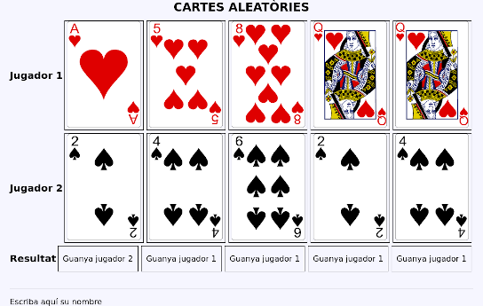
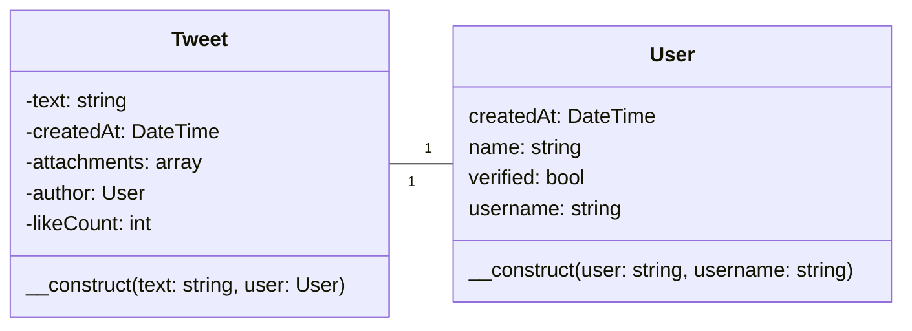
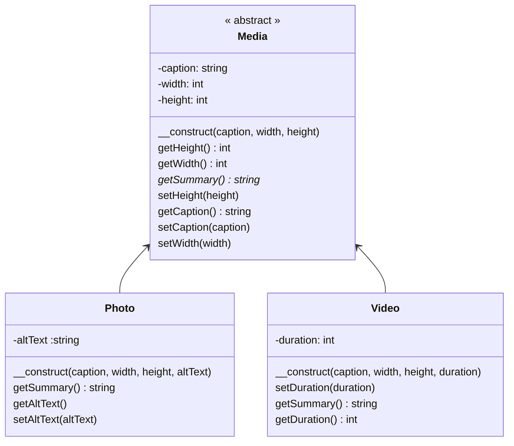
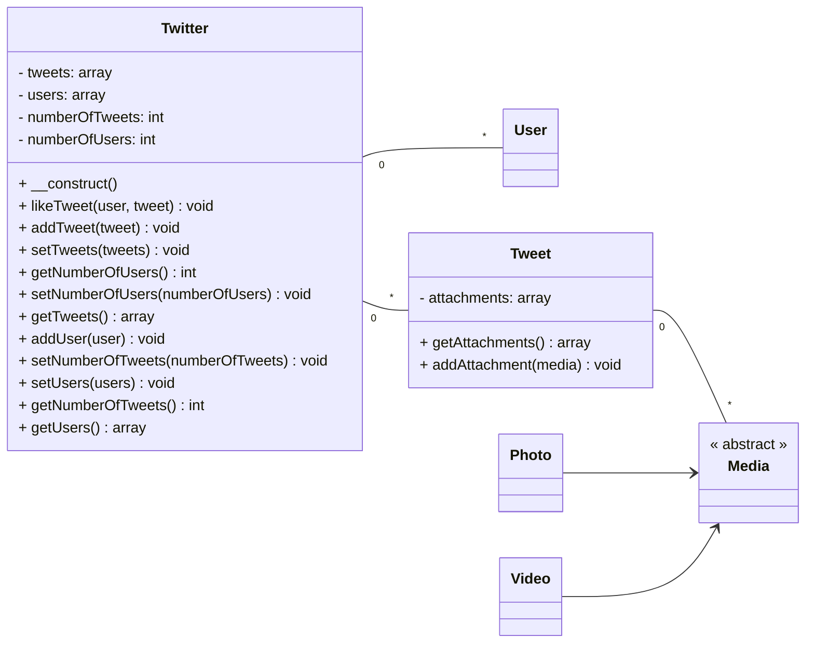

# Activitats

## POO Bàsic

301. Crea una classe `Employee` que represente un empleat amb el seu nom, cognoms i sou. Encapsula les 
propietats mitjançant mètodes _getters_/_setters_ i afegeix els següents mètodes:

     1. Obtenir el nom complet: `getFullname(): string`.
     2. Que torne un booleà indicant si deu o no pagar impostos (es paguen quan el sou és superior a 3333€): `mustPayTaxes():bool`.

1.   Afegeix una propietat privada que que emmagatzeme una sèrie de números de telèfons. Afegiu els següents mètodes:

     1. `public function addPhone(string $phone): void` → Afegeix un telèfon a l'array
     2. `public function listPhones(): string` → Torna els telèfons en separats per comes
     3. `public function emptyPhones(): void` → Elimina tots els telèfons

2.   Crea el constructor amb els paràmetres nom i cognoms. Si el constructor rep un tercer paràmetre, serà el sou. Si no, s’assignaran 1000€ com a sou inicial. Fes una versió fent ús de la propagació de propietats de PHP8.

3.   Afegeix una constant `MAX_SALARY` amb el valor del sou que ha de pagar impostos, i modifica el codi per utilitzar la constant.

4.   Completa el següent mètode amb una cadena HTML que mostre les dades d'un empleat dins d'un paràgraf i tots els telèfons mitjançant una llista ordenada (hauràs de crear un _getter_ per als telèfons):

    `public static function toHtml (Employee $emp): string`

5.   Representa la classe en UML.

6.   Crea una classe anomenada `Card` que contindrà la informació
     relativa una carta de la baralla francesa amb les seguents propietats:

     * `suit`, string, privada.
     * `symbol`, string, privada.
     * `value`, entera, privada.

     El constructor i el seus _getters_ i _setters_.

     Crea cinc objects diferents en un array i mostra'ls de forma aleatòria. 

     ```mermaid
     classDiagram
     class Card {
         -string suit
         -string symbol
         -int value
         +void function __construct (string, string, int)
     } 
     ```
    
7.   Crea una classe anomenada `CardCollection` que contindrà la propietat
     `cards` que serà un array de cartes (objectes `Card`).

     Hi haurà dues formes d'inserir cartes, mitjançant el mètode `CardCollection::add(array $array)` que rebrà un array de cartes i els afegirà a la propietat `cards` i el mètode `CardCollecion::addCard(Card $card)` que rebrà una carta i la inserirà en la propietat `cards`.

     A més, contindrà el mètode `shuffle()` que ordenarà les cartes de forma aleatòria.

     Instància la classe, afig 5 cartes, reordena-les i mostra-les.

     ```mermaid        
     classDiagram
     class CardCollection {
          -cards: array
          +add(cards: array)
          +addCard(card: Card): void
          shuffle()
          getCards() array
     }
     class Card {
         -suit: string
         -symbol: string
         -value: int
         __construct (suit: string, symbol: string, value: int)
     } 
     CardCollection "1"--"*" Card
     ```
            
8.   Crea el mètodo `writer` en la classe `CardCollection` de forma que mostre en format lliure la col·leció de cartes. Amb aquest mètode afegirem una nova capa d'abstracció ja que no caldrà accedir directament als mètodes de la classe `Card` per representar-les.  

9. Implementa la interfície `Iterator` en `CardCollection` de forma que es puguen recórrer la col·lecció de cartes en un `foreach`;
    
10.  Fent ús de les classes anteriors crearem una aplicació bàsica en la que s'enfronten dos jugadors. Un exemple de partida podria ser el següent:

    

    La classe `CardCollection` quedarà així:

     ```mermaid        
     classDiagram
     class CardCollection {
          -cards: array
          add(cards: array)
          addCard(card: Card) void
          ...
          deal(amount: int) array
          play() Card
     }

     ```
    
    Els requisits seran els següents:

     - Es repartiran 5 cartes per jugador.
     - El mètode `deal` que repartirà el número de cartes que s'indique com a paràmetre eliminant-les de la col·lecció.
     *  El mètode `play` jugarà una carta que s'eliminarà de la col·lecció.
     *  Cada tirada la guanya el jugador que té la carta més alta, segons el valor.
     *  La partida la guanya el jugador que ha guanyat més vegades.
     *  En cas d'empat es repartirà una nova carta a cada jugador.
    
    Així que en la aplicació interactuaran 3 objectes de tipus `CardCollection`.

11.  `abastract_game`: en l'activitat anterior vam crear tres objectes de tipus `CardCollection`.  Podem observar que alguns mètodes, com per exemple `deal` (_repartir_) tenen sentit en l'objecte quan representen la mà d'un jugador.

     Podem replantejar la solució de la següent manera:

     ```mermaid

     classDiagram
          direction LR
          class CardCollection {     

               << abstract >>
               #cards: array
               +add(cards: Card[])
               +addCard(card: Card) void
               getCards() Card[]
          }
     
          class Card {
              -suit: string
              -symbol: string
              -value: int
              __construct (suit: string, symbol: string, value: int)
     
          } 

          class Deck {                    
               shuffle()
               deal(amount: int = 1) Card[]
          }

          class Hand {                    
               play() Card
          }

          CardCollection "1"--"*" Card
          Deck --|> CardCollection
          Hand --|> CardCollection        
     ```

     En el diagrama anterior definim `CardCollection` com una classe abstracta, d'ella hereten dos classes `Deck` que representa la baralla i `Hand` que representa les cartes d'un jugador. Cada classe exten la funcionalitat afegint els seus propis mètodes.

     Recorda que una classe abstracta és un tipus de classe que no s'instància i sols poden ser heretades traslladant així un funcionamient obligatori a les classes filles (o subclasses). 

     Modifica la solució a l'activitat anterior amb la nova jerarquia de classes.

## Errors i excepcions

1.     `320-error-handling`: modifica l'activitat 303, `Empleat.php` de forma en cas que el sou siga negatiu llance una excepció amb el missage "El sou no pot ser negatiu". Captura l'excepció i mostra el missatge.
2.     `321-error-handling`: modifica l'activitat anterior llançant en esta ocasió una excepció personalitzada `InvalidWageException` amb el missatge per defecte "El sou no pot ser negatiu". Captura l'excepticó i mostra el missatge.


## Projecte: Truiter

En les següents activitats anem a posar en marxa el que serà el nostre projecte. Cal tenir en compte que es tracta d'un
projecte de caracter didàctic, així que algunes coses poden no ser del tot correctes des del punt de vista de la qualitat
del codi.

Per al projecte disposarem de la següent estructura de directoris:

```
.
├── index.php
├── src                
└── views
```

`src` contindrà les classes i `views` les vistes.

340.  Crea una classe per representar usuaris (`User`). Aquesta classe contindrà les propietats necessàries per a emmagatzemar un usuari de l'aplicació. El constructor rebrà com a paràmetres el nom i el nom d'usuari. En el cos del constructor assigna a la data de creació la data actual.

=== "Codi de prova"
     ```html+php
     <?php
     // index.php
     $user = new User('Bart Simpson', 'bart');
     ?>

     <p><?= $user->getName() ?> (@<?= $user->getUsername() ?>) - Creation
          date: <?= $user->getCreatedAt()->format('d-m-Y h:i:s') ?></p>
     ```
=== "Navegador"

     <pre>
     Bart Simpson (@bart) - Creation date: 11-10-2022 10:24:27
     </pre>


341.   Crea una classe per representar tweets (`Tweet`). Aquesta classe contindrà les propietats necessàries per a emmagatzemar un tweet. Crea els _setters_ i els _getters_. El constructor rebrà com a paràmetres el text i l'autor. En el cos del constructor assigna a la data de creació la data actual i al número de _likes_ 0.



=== "Codi de prova"

     ```html+php
     <?
     $user = new User('Bart Simpson', 'bart');
     // fem un delay de 4 segons perquè les dates de creació no coincidisquen
     sleep(4);
     $tweet = new Tweet('Hola món!', $user);
     ?>

     <h2>Users</h2>
     <p><?= $user->getName() ?> (@<?= $user->getUsername() ?>) - Creation
     date: <?= $user->getCreatedAt()->format('d-m-Y h:i:s') ?></p>

     <h2>Tweets</h2>
     <?php $tweetUser = $tweet->getAuthor() ?>
     <p><?= $tweetUser->getName() ?> (@<?= $tweetUser->getUsername() ?>) - Creation
     date: <?= $tweet->getCreatedAt()->format('d-m-Y h:i:s') ?></p>
     <p><?=$tweet->getText() ?></p>
     <p><?=$tweet->getLikeCount() ?></p>
     <hr />
     ```
=== "Navegador"
     <pre>

     **Users**
     Bart Simpson (@bart) - Creation date: 12-10-2022 10:42:51

     **Tweets**
     Bart Simpson (@bart) - Creation date: 12-10-2022 10:42:55
     Hola món!
     Like counter: 0
     
     </pre>


342. Crea la següent jerarquia de classes que represent els diferents tipus de mitjà que poden adjuntar a un tuit:



=== "Codi de prova"

     ```html+php
     <?php
     // index.php
     ...
     $video = new Video('Vídeo 1', 1080, 1024, 25);
     $photo = new Photo('Foto 1', 800, 600, 'Text alternatiu');
     ?>
     <h2>Media</h2>
     ...
     <?= $video->getSummary();?>
     <?= $photo->getSummary();?>
     ```

=== "Navegador"    
     
     **Media**

     Vídeo 1 [1080x1024] (25 s)

     Foto 1 (Text alternatiu) [800x600] 

  

343. Arribats a aquest punt anem a relacionar totes les classes que hem creat mitjançant la classe `Twitter`. Crea la classe
     representada en el gràfic tenint en compte que `users` és un array d'usuaris, `tweets` és un array de tuits i `attachements`
     un array de mitjans. S'han omitit algunes propietats i mètodes per simplicar el diagrama UML.




=== "Codi de prova"

     ```html+php
     <?php

     $twitter = new Twitter();

     $user = new User('Bart Simpson', 'bart');
     $twitter->addUser($user);

     // fem un delay de 4 segons perquè les dates de creació no coincidisquen
     sleep(4);
     $userH = new User('Homer Simpson', 'homerj');
     $twitter->addUser($userH);

     $users = $twitter->getUsers();

     sleep(4);
     $tweet = new Tweet('Hola món!', $user);
     $video = new Video('Vídeo 1', 1080, 1024, 25);
     $photo = new Photo('Foto 1', 1080, 1024, 'Text alternatiu');

     $tweet->addAttachment($video);
     $tweet->addAttachment($photo);

     $twitter->addTweet($tweet);
     $twitter->LikeTweet($user, $tweet);
     $twitter->LikeTweet($userH, $tweet);

     $tweet = new Tweet("Kids, just because I don’t care doesn’t mean I’m not listening.", $userH);
     $twitter->addTweet($tweet);

     $tweet = new Tweet("I’ve learned that life is one crushing defeat after another until you just wish Flanders was dead.", $userH);
     $twitter->addTweet($tweet);

     $tweets = $twitter->getTweets();
     ?>
     <h1>Welcome to Truiter</h1>

     <p><?= $twitter->getNumberOfUsers() ?> users, <?= $twitter->getNumberOfTweets() ?> tweets.</p>
     <h2>Users</h2>
     <?php foreach ($users as $user) : ?>
     <p><?= $user->getName() ?> (@<?= $user->getUsername() ?>) - Creation
          date: <?= $user->getCreatedAt()->format('d-m-Y h:i:s') ?></p>
     <?php endforeach; ?>

     <h2>Tweets</h2>

     <?php foreach ($tweets as $tweet) : ?>

     <?php $tweetUser = $tweet->getAuthor() ?>
     <p><?= $tweetUser->getName() ?> (@<?= $tweetUser->getUsername() ?>) - Creation
          date: <?= $tweet->getCreatedAt()->format('d-m-Y h:i:s') ?></p>
     <blockquote><?= $tweet->getText() ?></blockquote>
     <p>Like counter: <?= $tweet->getLikeCount(); ?></p>
     <?php if (count($tweet->getAttachments()) > 0) : ?>
     <h3>Attachments</h3>
     <ul>
          <?php foreach ($tweet->getAttachments() as $attachment) : ?>
               <li><?= $attachment->getSummary() ?></li>
          <?php endforeach; ?>
     </ul>
     <?php endif ;?>
     <hr/>
     <?php endforeach; ?>
     ```

=== "Navegador"

     <pre>

     **Welcome to Truiter**
     2 users, 3 tweets.     
     **Users**
     Bart Simpson (@bart) - Creation date: 13-10-2022 09:45:52
     Homer Simpson (@homerj) - Creation date: 13-10-2022 09:45:56     
     **Tweets**
     Bart Simpson (@bart) - Creation date: 13-10-2022 09:46:00
          Hola món!
     Like counter: 2
     *Attachments*
     - Vídeo 1 [1080x1024] ( 25 s)
     - Foto 1 (Text alternatiu) [1080x1024]

     Homer Simpson (@homerj) - Creation date: 13-10-2022 09:46:00
          Kids, just because I don’t care doesn’t mean I’m not listening.
     Like counter: 0

     Homer Simpson (@homerj) - Creation date: 13-10-2022 09:46:00
          I’ve learned that life is one crushing defeat after another until you 
          just wish Flanders was dead.
     Like counter: 0

     </pre>


344. Implementa la càrrega automàtica (autoload) de classes tenint en compte que:
     - Les classes estaran en el directori `src/App`.
     - L'espai de noms serà App.

    Crea les excepcions InvalidWidthMediaException i InvalidHeightMediaException que es llançaran quan alguna de les dimensions dels mitjans siga inferior a 300 píxels. Guarda-les en el directori src/App/Exceptions amb el namespace corresponent.
