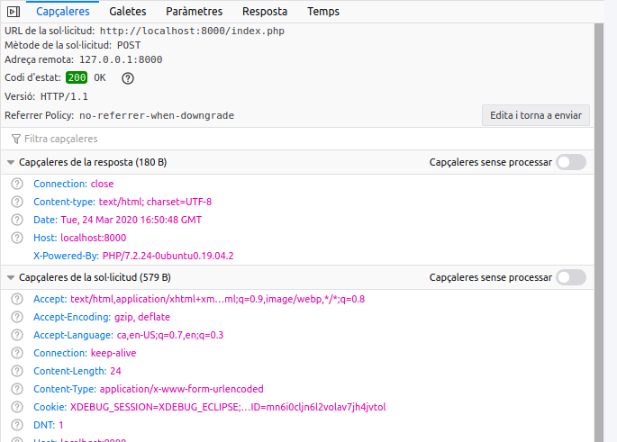
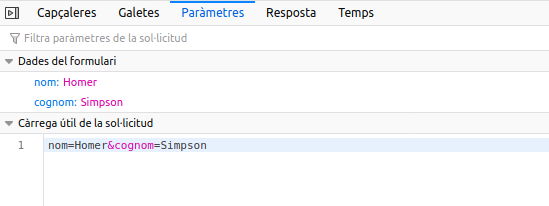
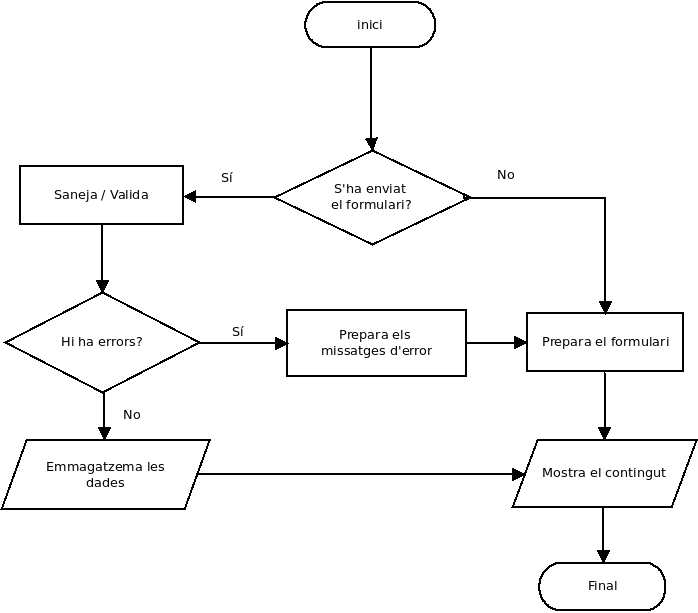

# Processament de formularis

Fins ara ens hem centrat a conèixer les característiques del llenguatge PHP. En aquesta unitat
posarem el focus en les característiques pròpies de les aplicacions web i com podem gestionar-les
amb PHP. Així, veurem com enviar informació mitjançant formularis, com processar-la i com podem mantenir informació entre
sol·licituds, és a dir, mantenir l'estat. 

## Variables predefinides
Les variables predefinides són variables internes de PHP que poden usar-se des de qualsevol àmbit, per això s'anomenen variables **superglobals**. Es tracta d'**arrays associatius** que contenen un conjunt de valors.

  * **$_SERVER**. Conté informació sobre l'entorn del servidor web i d'execució.
  * **$_GET, $_POST i $_COOKIE** contenen les variables que s'han passat al
script actual utilitzant, respectivament, els mètodes GET (paràmetres en la URL), HTTP POST i Cookies HTTP 
  * **$_REQUEST** junta en un solament el contingut dels tres *arrays anteriors,
`$_GET`, `$_POST` i `$_COOKIE`. 
  * **$_ENV** conté les variables que es puguen haver passat a PHP des de l'entorn en què s'executa. 
  * **$_FILES** conté els fitxers que es puguen haver pujat al servidor
utilitzant el mètode POST. 
  * **$_SESSION** conté les variables de sessió disponibles per al guió
actual.

[http://es.php.net/manual/es/language.variables.superglobals.php](http://es.php.net/manual/es/language.variables.superglobals.php)

## Què és una petició HTTP?

Una petició HTTP és una sol·licitud d'un recurs a un servidor. La petició es realitza a través d'unes URL. Amb la petició s'envien també paràmetres.

Hi ha diferents mètodes (`METHOD`) per a realitzar una petició (`GET`, `POST`, `PUT`, `DELETE`, `PATCH`, etc.). Els més habituals són `GET`, que ja coneixes, i `POST`. La resta són més utilitzats en les RESTful API.


## Mètode GET

El mètodo de sol·licitud GET té les següents característiques:

* S'utilitza per a sol·licitar dades d'un recurs. Mostren els paràmetres que 
* s'envien en la url. Es poden utilitzar directament en enllaços. 
* El resultat es pot emmagatzemar en cache. Romanen en l'historial del navegador. 
* La grandària dels paràmetres està limitat a 2048 caràcters.

*Exemple de petició GET*


*Inspecció de la petició*


*Inspecció de la petició*


### Accedir a les dades de la petició GET

Per a accedir a les dades usem la variable superglobal `$_GET`.
    
`$_GET` és un array associatiu les claus del qual coincidiran amb els noms que li hem donat als paràmetres.

Per a accedir als paràmetres de la petició anterior:

```php
echo $_GET['nom'].' '.$_GET['cognom']; // Homer Simpson
```

## Mètode POST

El mètode POST té les següents característiques:

* S'utilitza per a enviar dades a un recurs.
* Els paràmetres van en el cos de la petició, no són visibles per a l'usuari.
* La petició no es guarda en cau.
* No es pot utilitzar en un enllaç.
* No roman en l'historial.
* No tenim la limitació de grandària dels paràmetres.
* Es solen utilitzar en els formularis.

### Evitar el CSRF

En tota pàgina que reba paràmetres POST has de comprovar el **HTTP referer** del navegador, i que aquest siga de dins de la teua web. En PHP el _referer_ que envia el navegador s'emmagatzema en `$_SERVER['HTTP_REFERER']`. És a dir, sols processarem peticions 
que vinguen del teu lloc web.

!!! note "Més informació"
    En el següent enllaç trobareu més informació relativa als atacs CSRF [CSRF: explicación del ataque Cross Site Request Forgery](https://www.ionos.es/digitalguide/servidores/seguridad/cross-site-request-forgery/)

Seria tal com:

 ```php
 if(parse_url($_SERVER['HTTP_REFERER'], PHP_URL_HOST)!=$_SERVER['HTTP_HOST']) 
    die('Anti-CSRF'); 
 ```

!!! important
    Amb aquest codi estem obligant que el navegador envie un _referer_ si o sí. Per tant només ha d'utilitzar-se en pàgines a les quals el navegador accedisca des d'una altra pàgina de la nostra web.

    Òbviament no podem col·locar-ho en la primera pàgina a la qual s'accedeix a la nostra web (`index.php` o similar), ja que si l'usuari a escrit l'adreça a mà en la barra del navegador no s'enviarà referer cap i saltarà el sistema.


## Definició de formularis 

Com hem dit abans el mètode POST s'empra en els formularis. El formulari següent enviarà les dades a la pàgina `index.php` (atribut `action` de l'element `form`).

Utilitza el mètode `post` indicat en l'atribut `method`:

```html
<form action="index.php" method="post">
    <label for="nom">Nom</label>
    <input type="text" name="nom" value="">
    <br />
    <label for="cognom">Cognom</label>
    <input type="text" name="cognom" value="">
    <br />
    <input type="submit" value="Enviar">
</form>
```

*Inspecció de la petició: Headers*


*Inspecció de la petició: Paramètres*



### Accedir a les dades de la petició POST

Usem la variable superglobal `$_POST`. Funciona igual que `$_GET`, però amb els noms (atribut `name`) que li hem donat als camps del formulari.

En depuració podem mostar totes les dades rebudes:
        
```php
var_dump ($_POST);
print_r($_POST)
```

Per a mostrar les dades individualment:

```php
echo $_POST['nom'];
echo $_POST['cognom'];
```


### Accedir a paràmetres no existents

Errors del tipus  

```
Notice: Undefined index: nom in /home/ubuntu/index.php on line 6
```
ens indiquen que la clau `nom`  no existeix en l'array `$_POST`. La variable supergloblal `$_POST` està buida si no s'ha
enviat el formulari.

Per a evitar aquest tipus d'errors és important verificar que s'haja enviat el formulari prèviament:

```php
if ($_SERVER['REQUEST_METHOD'] === 'POST')
{

}
```

### Paràmetres multivalents

Hi ha elements HTML que envien diversos valors:    
  - `select multiple`
  - `checkbox`

Per recollir les dades, el nom de l’element ha de ser una matriu (_array_).

```html+php
<select name="lenguajes[]" multiple="true">
    <option value="c">C</option>
    <option value="java">Java</option>
    <option value="php">PHP</option>
    <option value="python">Python</option>
</select>

<input type="checkbox" name="lenguajes[]" value="c" /> C<br />
<input type="checkbox" name="lenguajes[]" value="java" /> Java<br />
<input type="checkbox" name="lenguajes[]" value="php" /> Php<br />
<input type="checkbox" name="lenguajes[]" value="python" /> Python<br />
```

Així doncs, recopilant les dades:

```html+php
<?php
$lenguajes = $_GET["lenguajes"];

foreach ($lenguajes as $lenguaje) {
    echo "$lenguaje <br />";
}

```
### Validació de formularis 

Sempre hem de comprovar que les dades que envia el formulari són correctes.

Les validacions a realitzar són les següents:

1. Els camps requerits no han de quedar buits. Ni contenir espais en blanc a l'inici i al final.
2. Els camps correu electrònic, data o URL han de tenir el format esperat.
3. Tots els camps s'han de filtrar amb `htmlspecialchars` per a evitar atacs de _Cross-site Scripting_ (XSS).

Aquest article sobre _Cross-site Scripting_ és molt il·lustratiu: [PHP Form Validation](https://www.w3schools.com/php/php_form_validation.asp)

!!! important "Validem en el client o el servidor?"
    La resposta és senzilla: en els dos llocs. La validació en el client millora la usabilitat mentre que la validació en el servidor ens permet una validació més robusta i segura.

#### Valors buits

1. Els camps requerits no haurien de quedar-se buits.
2. Per a verificar que un valor no queda buit podem utilitzar diverses funcions:
      - La funció `empty()`
      - La funció `isset()`.
      - L'operador _coalesce_ `??`.

#### Espais en blanc

1. Hem d'eliminar els espais en blanc del principi i final dels camps.
2. S'utilitza la funció `trim`

#### Escapar l'entrada

Sempre hem de filtrar l'entrada amb `htmlspecialchars` abans de mostrar el camp amb `echo` o similar. Acò convertirà
qualsevol caràcter especial d'HTMLl en l'entitat corresponent, així no interferirà en el programa.

#### Comprovar l'email

Per a verificar si un email és correcte podem utilitzar la funció `filter_var` 

```php
filter_var($email, FILTER_VALIDATE_EMAIL)
```
o la funció `filter_input` quan obtenin les dades directament d'una variable externa.

```php
// suposem que rebem les dades d'un formulari que té un quadre de text de nom 'email'
$email = filter_input(INPUT_POST, 'email', FILTER_VALIDATE_EMAIL)

```

#### filter_input

```php
filter_input(int $type, string $variable_name[, int $filter=FILTER_DEFAULT[, mixed $options]]):mixed
```
La funció `filter_input` agafa una variable externa (`$_GET`, `$_POST`, etc) concreta pel seu nom i aplica el filtre indicat.

Els filtres poden [sanejar](https://www.php.net/manual/es/filter.filters.validate.php) o [validar](https://www.php.net/manual/es/filter.filters.sanitize.php) les variables externes.

Per exemple, si volem agafar el valor del paràmetre *nom*  del querystring (`http://localhost/index.php?nom=<h1>Homer</h1>`) usarem el tipus `INPUT_GET`.

El filtre `FILTER_SANITIZE_STRING` elimina etiquetes, i opcionalment elimina o codifica caracters especials.

```php
$nom = filter_input(INPUT_GET, 'nom', FILTER_SANITIZE_STRING).  // $nom = Homer
```

Més informació en:

* [filter_var](http://php.net/manual/es/function.filter-var.php)
* [filter_input](http://php.net/manual/es/function.filter-input.php)

#### Comprovar la data

* Per a comprovar la data hem de crear una funció a aquest efecte.
* Podem utilitzar el mètode estàtic `createFromFormat` de la classe `DateTime`

Més informació: [http://php.net/manual/es/datetime.createfromformat.php](http://php.net/manual/es/datetime.createfromformat.php)

#### Exemple

```php
$data1 = "2001-05-02"; // Data és de tipus string
// DateTime::createFromFormat converteix una cadena de text a on objecte DateTime
// ens tornarà una instància de DateTime o FALSE en cas d'error.

$dt1 = DateTime::createFromFormat('Y-m-d', $data1);  

if ($dt1 === false) {
    echo "La data d'inici és incorrecta";
}
```

https://www.php.net/manual/es/function.strtotime.php

També és habitual trobar els controls de data separats en 3 elements `input`. Un per a l’any, l’altre per a mes i l’altre per al dia.


### Bones pràctiques en l’obtenció de dades des de l’exterior

Cal seguir les següents bones pràctiques:

1. No confieu mai (mai) en l’entrada des de l’exterior del vostre PHP.
2. Sanegeu i valideu l’entrada de dades sempre.
3. Les funcions `filter_var()` i `filter_input()` poden sanejar el text i validar els formats de text (per exemple, adreces de correu electrònic, enters).
4. Recordeu que l’entrada de dades no es limita a formularis enviats per l’usuari. Els fitxers carregats i descarregats, els valors de sessió, les dades de galetes i les dades de serveis web de tercers també són dades que venen de l'exterior.

A manera de resum podíem resumir la gestió de formularis en el següent diagrama de flux.




En els següents recursos trobaràs informació addicional sobre els controls de formularis en HTML5:

* [Formularios en HTML](https://developer.mozilla.org/es/docs/Learn/HTML/Forms) en MDN web docs.
* [Formularios en HTML5](https://developer.mozilla.org/es/docs/HTML/HTML5/Forms_in_HTML5) en MDN web docs.
* [HTML Forms](https://www.w3schools.com/html/html_forms.asp) en W3CSchools.


### Reomplint un formulari

Un _sticky form_ és un formulari que recorda els seus valors. Per fer -ho, hem d’omplir els atributs de valor dels elements HTML amb la informació que contenia:

```html+php
<?php
if (!empty($_POST['modulos']) && !empty($_POST['nombre'])) {
  // Aquí se incluye el código a ejecutar cuando los datos son correctos
} else {
  // Generamos el formulario
  $nombre = $_POST['nombre'] ?? "";
  $modulos = $_POST['modulos'] ?? [];
  ?>
  <form action="<?php echo $_SERVER['PHP_SELF'];?>" method="POST">
   <p><label for="nombre">Nombre del alumno:</label>
    <input type="text" name="nombre" id="nombre" value="<?= $nombre ?>" /> 
   </p>
   <p><input type="checkbox" name="modulos[]" id="modulosDWES" value="DWES"
    <?php if(in_array("DWES",$modulos)) echo 'checked="checked"'; ?> />
    <label for="modulosDWES">Desarrollo web en entorno servidor</label>
   </p>
   <p><input type="checkbox" name="modulos[]" id="modulosDWEC" value="DWEC"
    <?php if(in_array("DWEC",$modulos)) echo 'checked="checked"'; ?> />
    <label for="modulosDWEC">Desarrollo web en entorno cliente</label>
   </p>
   <input type="submit" value="Enviar" name="enviar"/>
  </form>
<?php } ?>
```

## Pujada de fitxers


Per a pujar fitxers PHP implementa un mecanisme senzill a través de la variable superglobal `$_FILES`.

En [Pujada d'arxius](https://www.php.net/manual/es/features.file-upload.php) disposeu de tota la informació necessària per a gestionar la pujada d'arxius.

### Formulari

Per poder utilitzar el tipus `file` en l'element `input` cal que el formulari incloga l'atribut `enctype` amb el valor `multipart/form-data`. 

El valor de l'atribut `name` de l'element `input` serà l'índex de l'array associatiu `$_FILES` que ens permetrà obtenir tota la informació del procés de pujada del fitxer.

En el següent exemple:

```html
<form action="upload.php" enctype="multipart/form-data" method="POST">
    <input type="hidden" name="MAX_FILE_SIZE" value="10240">
    <input type="file" name="image" />
    <input type="submit" value="Upload" />
</form>
```
Emprarem `$_FILES['image']` per obtenir les dades de l'arxiu penjat.

### Variable superglobal `$_FILES`

Cada element en `$_FILES` és un array que aporta informació sobre el fitxer pujat. Les claus més importants són:

 * `name`. El nom original del fitxer pujat. No és massa útil perquè el sistema original pot tindre convencions diferents i pot generar col·lisions si l'utilitzem per a emmagatzemar-lo en la seua ubicació definitiva.
 * `type`. El tipus MIME del fitxer deduït pel navegador.
 * `size`. La grandària en bytes del fitxer. Si el fitxer és massa gran el valor enviat serà 0.
 * `tmp_name`. El nom temporal del fitxer en el servidor on s'ha emmagatzemat el fitxer pujat. 

### Moure el fitxer

Com que el fitxer pujat es guarda en una carpeta temporal hem d'emprar la funció [`move_uploaded_file`](https://www.php.net/manual/es/function.move-uploaded-file.php) per a guardar-lo en la ubicació definitiva. 

La funció [`is_uploaded_file`](https://www.php.net/manual/es/function.is-uploaded-file.php) ens permet a assegurar-nos que el fitxer ha estat pujat usant HTTP POST i no es tracta d'un fitxer maliciós.

`move_uploaded_file` ja fa eixa comprovació en executar-se.

### Gestió d'errors

PHP torna un codi d'error en `$_FILES`. El codi es pot trabar en la clau `error`. Per exemple: `$_FILES['image']['error']`. 

Els missates d'error més importants són:

* `UPLOAD_ERR_OK`: La pujada ha sigut correcta.
* `UPLOAD_ERR_INI_SIZE`: La grandària del fitxer que s'intenta pujar és major que el valor indicat en la directiva `upload_max_filesize`.
* `UPLOAD_ERR_FORM_SIZE`: La grandària del fitxer que s'intenta pujar és major que el valor indicat en el formulari en `max_file_size`. 
* `UPLOAD_ERR_NO_FILE`: No s'ha enviat cap fitxer.

En [Explicació dels missatges d'error](https://www.php.net/manual/es/features.file-upload.errors.php) teniu més informació.

