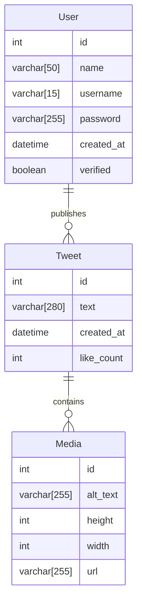

# Activitats

501. `501-querying.php`. Importa mitjançant PHPMyAdmin la base de dades [movies.sql](assets/movies.sql). Crea la connexió i fes les següents consultes usant consultes preparades amb marcadors coneguts:
     1.   Mostra en un array associatiu (pots usar `var_dump`) el _id_ i el _títol_ de totes les pel·lícules.
     2.   A partir de l'activitat anterior, modifica la sentència SQL perquè les pel·lícules apareguen ordenades pel _títol_.
     3.   Mostra en una array associatiu el _id_, el _títol_ i el _nom del gènere_ de totes les pel·lícules ordenades per la data d'estrena de forma descendent (pista: caldrà fer un `JOIN`).
     4.   Mostra en un array associatiu les dades de la pel·lícula amb `id` igual a `459489`. Cal que uses `bindValue` per vincular el paràmetre a la consulta preparada.
     5.   Mostra en un array associatiu el _id_ i el _títol_ de les pel·lícules que tinguen en el títol el text `Te`, han d'eixir-ne 2. Cal vincular els paràmetres mitjançant un paràmetre del mètode `execute`.
     6.   Mostra en un array associatiu el _id_ i el _títol_ de les pel·lícules que anteriors a 2020.
     7.   Mostra en una taula els generes.

502. `502-manipulating.php`. Realitza, sobre la base de dades `Movies` les següents accions:
     1.   Insereix una nova pel·lícula indicant el nou identificador assignat. Mostra-la en un array associatiu (`var_dump`).
     2.   Modifica el títol de la pel·lícula que acabes d'inserir afegint-li "(còpia)" al títol actual. Associa els paràmetres en l'`execute`.
     3.   Insereix un nou gènere i assigna-li'l a la pel·lícula. Usa en aquest cas `bindParam` per associar els paràmetres.
     4.   Elimina el nou gènere. És possible? Per què?
     5.   Elimina la pel·lícula i, després, el gènere.

503. `503-contact-info`. Crea una base dades anomenada `contact-info` on 
      emmagatzemarem les dades recollides en el formulari de l'activitat 440. Tingues en compte que el gènere, les hores de contacte i les aficions seran taules independents (utilitza les claus dels arrays com a clau primària) que estaran relacionades amb la taula principal.

      Còpia l'activitat 440 i modifica-la perquè les dades s'emmagatzemem en la base de dades.

## Projecte `Truiter`

Implementa la següent base de dades `truiter`:

504. Adapta el projecte Truiter perquè extraga la informació de la base de dades:
     1. `index.php` mostrarà tots els tuits per ordenats per data de forma descendent.
     2. `login.php` comprovarà les credencials dels usuaris en la base de dades. 
     3. `tweet-new.php` permetrà als usuaris autenticats crear un nou tuit.

505. Afig al projecte una pàgina de registre (`register.php` i `register-process.php`) que sol·licite 
     a l'usuari les dades requerides per registrar-se tenint en compte el següent:
     1. La data de creació serà per defecte el moment actual.
     2. Per defecte el compte no serà verificat.
     3. El nom d'usuari haurà de ser únic.
     4. La contrasenya haurà de sol·licitar-se dues vegades, per comprovar que l'usuari les ha escrit bé, i s'haurà d'emmagatzemar després d'aplicar-li una funció resum (_hash_). Veure l'apartat [No conèixer les contrasenyes](../04-web-programming/04-04-best-practices.md#no-coneixer-les-contrasenyes) de la unitat 4.

506. Afig al projecte una pàgina de perfil d'usuari (`profile.php`) des de la que l'usuari podrà editar el seu nom d'usuari i el seu nom i eliminar, amb confirmació, el seu compte.

507. Afig al projecte un buscador de tweets pel seu contingut.