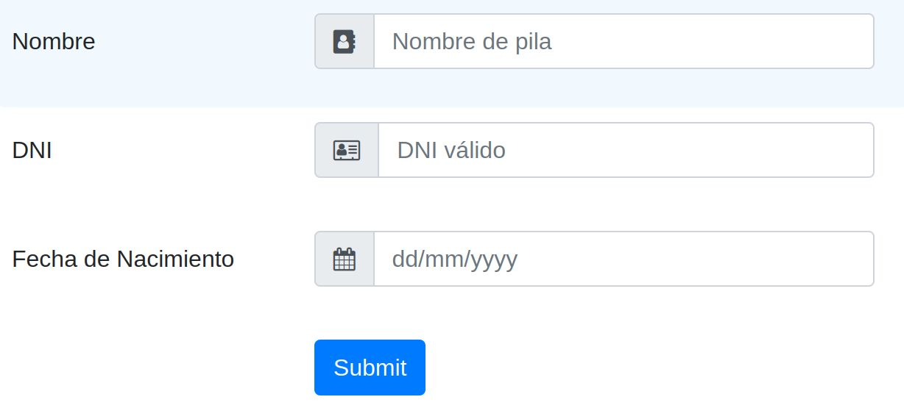

# Introducció al testing
## Tests?! ¡No tinc temps per a això!

Moltes vegades quan s'intenta ensenyar a fer proves o s'explica com això millorarà la
qualitat del programari la resposta que obtenim és "No tinc temps per això", "L'aplicació ja està
en producció, perquè provar-la ara?" i altres respostes similars que són una mostra de que el
_testing_ no es comprèn correctament.

No obstant això, en aquests mateixos ambients on se'ns diu que no hi ha temps per al _testing_, podem veure
com els desenvolupadors fan servir gran part de la seva jornada laboral en fer proves i altres activitats
que podrien ser minimitzades amb un bon conjunt de tests:

* Proves manuals.
* _Debugging_
* Compilacions
  
I aquestes són les més òbvies. Per exemple, les proves manuals són molt lentes, tedioses i solen provar
pocs casos. En el cas del _debugging_ arriba a ser tediós i moltes vegades el problema que busquem és
difícil de localitzar i, tanmateix, si hi hagués un Test Automàtic hauríem pogut detectar-ho de manera més
ràpida i perdre així menys temps.

## ¿Què són els Test? 

Una definició que destaca per la seua simplicitat i concrecció és la següent:

> Un test és una especificació de l'aplicació

Què vol dir això? Doncs que un test és simplement un requisit que, a part de definir-nos una
necessitat fa una *segona funció*  que consisteix a **verificar que aquest es compleix**.

Anem a veure alguns exemples.

Partim de la idea d'una funció que sume dos números:

```php
function sum(int $a, int $b){
  return $a+$b;
}
```

Quins serien els requisits d'aquesta funció? Un primer requisit podria ser que, efectivament, la función ha de sumar dos números qualsevols.

Representant-ho com un test seria:

```php
function shouldAddAPairOfNumbers(){
  return 5 === sum(2,3)
}

```
Un altre requisit podria ser que sume números negatius. Per assegurar que aquest requisit s'està
complint, podem crear un altre test:

```php
function shouldAddNegativeNumbers(){
  return 3 === sum(5,-2)
}

```
En els anteriors exemples hem vist el que bàsicament és un test (unitari en aquest cas): una funció
que comprova que una característica o especificació de l'aplicació es compleix. Altres definicions més acadèmiques són:

> El Testing de Software es una investigació dirigida a proporcionar a les parts interessades
(_stakeholders_) informació sobre la qualitat del producte o servei que està provant-se.

- Kaner, Cem (November 17, 2006). _Exploratory Testing. Quality Assurance Institute Worldwide Annual
Software Testing Conference_. Orlando, FL. Retrieved November 22, 2014.

> En el camp del _testing_ de programari, l'automatización de test és l'uso de programari (separat del
que s'està provant) per a  controlar l'execució de les proves i la comparació dels resultats reals amb els previstos

- Kolawa, Adam; Huizinga, Dorota (2007). _Automated Defect Prevention: Best Practices in Software
Management_. Wiley-IEEE Computer Society Press.

### Avantatges dels Test 
1. Els test es poden executar, els requisits no. Això ens permet mantindre un cert grau de qualitat en el funcionament de la nostra aplicació al llarg de tot el desenvolupament.
2. Es pot executar diverses vegades. Quan realitzem proves a mà moltes vegades per fàstig o el
repetitiu del procés acabem provant sempre el mateix o fins i tot podem trobar un
error i no recordar quins paràmetres usem per a reproduir-lo.
3. En executar-los provem altres funcionalitats. Quan provem a mà una característica de l'aplicació
moltes vegades no som conscients de l'abast d'aquesta, no obstant això, si tenim una
bona bateria de Tests és altament probable que en executar-los estiguem provant altres àrees de l'aplicació
que es poden veure compromeses amb els nostres canvis.
4. Eviten que molts _bugs_ arriben a producció. Quan s'introdueixen fallades en el programari sense tindre
Tests és comú que aquests arriben fins a l'entorn productiu i passen latents mesos fins que un
usuari o procés, amb els paràmetres adequats, provoque l'error i isca a la llum (provocant
perdudes d'usuaris, benefici per a l'empresa de programari, etc). Tenint Tests podrem
minimitzar notablement aquest tipus de situacions.

Hi ha molts més avantatges però aquestes són algunes de les més notables. 

## Tipus de proves

Existeixen multitud de casos de Test, ací n'introduirem uns pocs i els acompanyarem d'una xicoteta
explicació.

És important aclarir que sol haver-hi un error en la denominació general, desembocant en una
definició errònia del que és un **test funcional**. En el següent llistat podrem veure diferents test
funcionals (ja que proven funcionalitat del nostre programari).

- **Test Unitaris**: S'encarreguen de provar una unitat de codi de forma aïllada. Aquesta unitat no ha d'estar lligada a cap
mena d'entrada/eixida (ja siga aquesta una base de dades, disc...). Són les proves més concretes i les més ràpides, per això
 tendeixen a ser els més nombrosos.

- **Integració**: Proven una unitat però permetent contacte amb entrada/eixida. Són mitjanament
ràpids però no tant com els unitaris. També es poden considerar test d'integració (o de Components/Sistema)
els que proven diferents parts del programari interdependent entre sí.
- **Intefície d'usuari (UI)**: Són els test que fan comprovacions sobre la base de la interfície d'usuari del nostre sistema.
- **End to End (e2e)**: Test que comproven la nostra aplicació de punta a punta. És a dir, des de la interacció
de l'Usuari o l'Actor que desencadene l'execució del programari fins que se li retorna algun tipus de resposta.
Al costat dels de UI són els més costosos (dels automatitzats) ja que solen implicar alçar
serveis, bases de dades i fins i tot navegadors per a simular la petició.
- **Manuals**: Són també funcionals ja que proven el mateix que els de *UI* o *EndToEnd* però en lloc de ser
executats per un codi que interactua amb una API o un navegador són executats per un humà
amb la conseqüent lentitud extra. Solen ser limitats pel cost monetari i de temps, limitant-se a uns
certs tipus com a Test d'Exploració o *Monkey Testing*.

#### I quins són els test no funcionals?
Són test que no proven funcionalitats de l'aplicació si no que ens asseguren un altre tipus de comportaments.

A continuació llistem alguns:
- Test d'Estrés: Comproven el rendiment de la nostra aplicació sota estrés.
- Test de Càrrega: Comproven on està el límit de càrrega de la nostra aplicació.
- Test d'Escalabilitat: Comproven que l'aplicació escala correctament. És útil en aplicacions
Distribuïdes, *Serverless...

Hi ha molts més tipus de Test, tant funcionals com no funcionals però hem nomenat els més
coneguts i comuns.

## Test Manuals en el flux de desenvolupament

Donat un formulari com el de la següent imatge i assumint que no tenim test automatitzats i sols fem test manuals:

<figure markdown>  
{ width="500" } 
</figure>

Quants noms serem capaços de provar per a assegurar el correcte funcionament? Podrem cerciorar-nos que provem suficients DNIs? I dates?
El més probable és que provem tres o quatre diferents casos durant el desenvolupament i altres punts al final d'aquest per a comprovar que la funcionalitat s'executa aparentment sense problemes.

### Problemes dels test manuals

- Necessitem que l'aplicació siga funcional. Fins que l'aplicació no siga executable d'alguna manera
 no podrem realitzar cap prova.
- Necessitem configurar dependències, dades inicials, infraestructura (base de dades,
configuracions...)
- Provem una quantitat de casos bastant limitat. Amb Test automatitzats podríem aconseguir
que es proven un rang de valors aleatoris o que el valor que s'use en la prova canvie amb
cada execució, etc.
- És difícil repetir tests i encara més realitzar proves anteriors. Amb els test manuals es dificulta el
poder passar casos de prova d'una altra persona, implicant documents, processos, etc amb la
lentitud que això provoca i la inviabilitat d'introduir-ho en el procés de desenvolupament.

## Característiques dels tests unitaris
Els test unitaris proven una unitat de codi o *System Under Test(SUT)*. En l'exemple que vèiem a l'inici provàvem una
funció que sumava dos números. Aquesta unitat es prova de forma aïllada. Si la unitat sota test tinguera algun tipus de dependència
hauríem de falsejar-la. El mateix si necessitara accedir a alguna mena de base de dades o similar. D'aquesta aconseguirem independència per a la prova de la unitat que ens resulta d'interés en el test.

**Utilitzen dobles de test (_Test Doubles_)**. Per a realitzar el que comentem en l'anterior pas podem fer ús de dobles de tests.
Aquest concepte represensta els objectes, classes o funcions que falsegen a la seua
contrapart real per a enganyar la unitat sota proves i obtindre el comportament que ens
interessa assegurar. En la següent imatge veiem com creem objectes que falsegen cert
comportament per a provar el que ens interessa, en aquest cas que si creem un "Conductor" a partir de
 un objecte "User" menor d'edat, obtenim una Excepció.

```php
public function testOnlyAdultCanDrive(){
    $this->expectException (MinorsAreNotAllowedToDrive::class);

    $userStub=$this->createMock(User::class);    
    $userStub->method('getAge')
             ->willReturn(16);
    
    $carStub = $this->createMock(Car::class);
    
    new Drive($userMock,$carStub);
}
```
**Són ràpids**. Una bateria de milers de Test Unitaris pot executar-se en qüestió de minuts. Això
permet que siga fàcil d'incorporar al procés de desenvolupament i s'executen amb cada canvi que
realitzem.

**Són repetibles**. En estar programats podem repetir un mateix test les vegades que siga necessari.
Comproven que res s'haja trencat És a dir, comproven que els canvis que introduïm no
afecten altres parts de l'aplicació.

**Feedback Loop més curt**. Per la seua velocitat i la possibilitat d'executar-los cada poc temps acurten
el temps que passa des que s'introdueix un _bug_ en el programari fins que aquest és detectat i
solucionat.

**Pipelines de CI, Hooks...** Donada la seua velocitat d'execució aquest tipus de test és perfecte per a ser
introduït en una **Pipeline d'Integració Contínua** o un **Hook de Git** que, per exemple, controle que
abans de fer un _push_ dels canvis al servidor passen tots els test.

**Faciliten el codi desacoblat**. Com veurem resulta molt més fàcil provar codi desacoblat
pel que si ens acostumem a fer test Unitaris el nostre codi acabarà sent més
desacoblat.

***refactoritzar sense por de trencar alguna cosa**. Tindre una bona bateria de Tests ens permet fer
_refactoring_ sense tindre pànic al fet que es trenquen altres parts de l'aplicació. Si es donara el cas un test
fallaria i immediatament podríem veure com és el problema i actuar en conseqüència.

## Piràmide de Test i Gelat de Test 
En la següent imatge veiem una contraposició de dues distribucions de Test.


<figure markdown>  
{ width="500" } 
</figure>

En l'esquerra podem veure el que es coneix com a "Gelat de Testing", en el qual abunden els test
manuals i els pocs que hi ha automatitzats són els test _End to End_ o de _UI_. El _Testing ice-cream_ és un antipatró de _Testing_ (en la majoria de casos) en el qual són nombrosos els test que més costa realitzar i brillen per la seua absència els Test més lleugers i ràpids (integració i, sobretot, unitaris).

A la dreta tenim la Piràmide de Test. Ací podem veure com els test més abundants són Unitaris i
d'Integració, els més ràpids, mentre que el número de test lents com els d'Acceptació és molt
menor i els test manuals estan reservats a test Exploratoris.

## Introducció a TDD

Desenvolupament guiat per proves de programari, en anglès: _Test-driven development (TDD)_, és una pràctica d'enginyeria de programari que involucra unes altres dues pràctiques: Escriure les proves primer (_Test First Development_) i Refacció (_Refactoring_). Per escriure les proves generalment s'utilitzen les proves unitàries (unit test en anglès). En primer lloc, s'escriu una prova i es verifica que les proves fallen. A continuació, s'implementa el codi que fa que la prova passi satisfactòriament i seguidament es refacciona el codi escrit. El propòsit del desenvolupament guiat per proves és aconseguir un codi net que funcioni. La idea és que els requisits siguin traduïts a proves, d'aquesta manera, quan les proves passin es garantirà que el programari compleix amb els requisits que s'han establert. 

Com que no és l'objectiu d'aquest curs aprofundir trobarem més informació en els següents recursos:

* Desenvolupament guiat per proves. (2021, 19 de novembre). _Viquipèdia, l'Enciclopèdia Lliure_. Data de consulta: 21:25, novembre 19, 2021 de [//ca.wikipedia.org/w/index.php?title=Desenvolupament_guiat_per_proves&amp;oldid=28627832](http://ca.wikipedia.org/w/index.php?title=Desenvolupament_guiat_per_proves&amp;oldid=28627832).
* La kata del DNI para aprendre TDD. (2018, 12 de desembre). _Fran Iglesias_.  [https://franiglesias.github.io/iniciacion-tdd/](https://franiglesias.github.io/iniciacion-tdd/).
* Curso Testing. _Andros Fenollosa_ [https://programadorwebvalencia.com/cursos/testing/introducci%C3%B3n/](https://programadorwebvalencia.com/cursos/testing/introducci%C3%B3n/)

