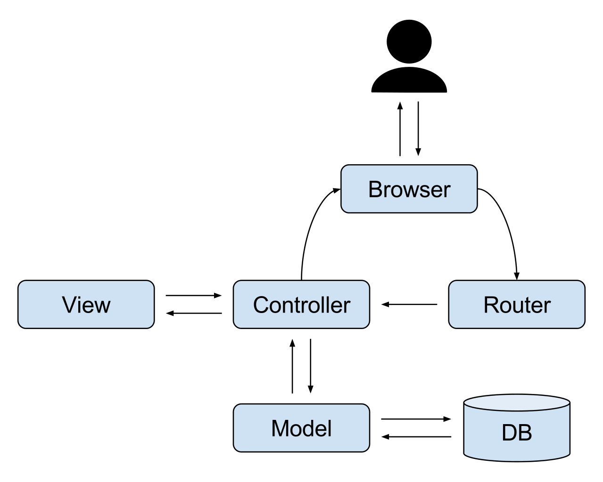

# Cap a un _framework_ MVC

En aquesta unitat implementarem els components bàsics del nostre _framework_. Explicarem la seua funció i com 
implementar-lo de forma bàsica.

També es veuran alguns conceptes molt utilitzats en els _frameworks_ professionals.

## Model Vista Controlador

_Model–view–controller_ (MVC) és un **patró de disseny de programari** que s'utilitza habitualment per desenvolupar interfícies d'usuari que divideixen la lògica del programa relacionada en tres elements interconnectats. Això es fa per separar les representacions internes de la informació de la forma en què es presenta i accepta la informació a l'usuari.

Aquest patró es va fer popular per desenvolupar aplicacions web. Els llenguatges de programació populars tenen frameworks MVC que faciliten el desenvolupament. Per exemple:

- En Python, Django.
- En Ruby, Ruby on Rails.
- En Javascript, Angular i React.js.
- En PHP, Symfony i Laravel.

<figure markdown>
  {width="400"}
  <figcaption>Esquema MVC</figcaption>
</figure>

<figure markdown>
  {width="400"}
  <figcaption>Esquema MVC ampliat</figcaption>
</figure>

- **Model**: El component central del patró. És l'estructura de dades dinàmiques de l'aplicació, independent de la interfície d'usuari. **Gestiona directament les dades, la lògica i les regles de l'aplicació**.
- **Vista**: Qualsevol representació d'informació com un gràfic, un diagrama o una taula. Són possibles diverses visualitzacions de la mateixa informació, com ara un gràfic de barres per a la gestió i una vista tabular per als comptables.
- **Controlador**: Accepta l'entrada i la converteix en ordres per al model o la vista per a finalment tornar la resposta al client.

A més de dividir l'aplicació en aquests components defineix les interaccions entre ells.
- El model s'encarrega de gestionar les dades de l'aplicació. Rep l'entrada de l'usuari mitjançant el controlador.
- La vista fa la presentació del model en un format determinat.
- El controlador respon a l'entrada de l'usuari i realitza interaccions amb els objectes del model de dades. El controlador rep l'entrada, opcionalment la valida i després passa l'entrada al model.

Igual que amb altres patrons de programari, MVC expressa el "nucli de la solució" a un problema alhora que permet adaptar-lo a cada sistema. Els dissenys MVC particulars poden variar significativament de la descripció tradicional.
