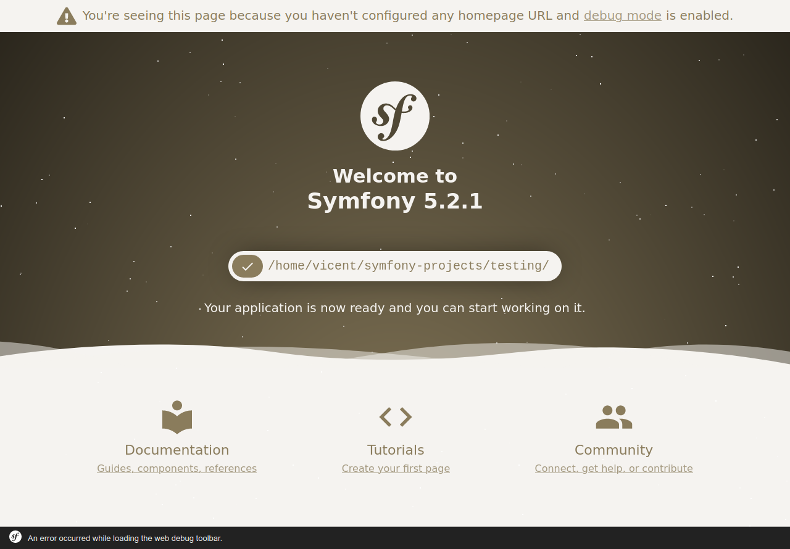

# Introducció als frameworks PHP i a Symfony

??? info "Objectius"
    * Comprendre la importància de l'ús de frameworks per al desenvolupament d'aplicacions
    * Entendre la arquitectura de les aplicacions Symfony.
    * Desenvolupar una aplicació amb Symfony.

??? info "Continguts"
    1. Instalación y configuración de Symfony
       1. Arquitectura MVC
       2. Introducció a YAML
    2. Vistes
       1. Motor de plantilles Twig
    3. Injecció de dependències: Contenidors
    4. El model
       1. Doctrine
    5. Creació i validació de formularis
    6. Seguretat i Control d’accés
    7. _Bundles_

??? info "Continguts procedimentals"
    * Instal·lació i configuració de Symfony 5.
    * Ús del motor de plantilles Twing per creació de vistes.
    * Implementació de contenidors de serveis per a la injecció de dependències.
    * Ús de l'ORM Doctrine per treballar amb la base de dades
    * Creació i validació de formularis utilitzant _form builder_.
    * Implementació de control d'accés
    * Inserció de _bundles_ en el nostre projecte

## Frameworks PHP

Un **framework** és una eina que proporciona una sèrie de mòduls que
ajuden a organitzar i desenvolupar un producte de programari. En el cas
concret dels frameworks PHP, la majoria d'ells proporcionen una sèrie
de comandos o eines per a crear projectes amb una estructura determinada
(normalment, seguint el patró MVC), de manera que ja
donen una base de treball feta, i facilitats per a poder crear el model
de dades, la connexió a la base de dades, les rutes de les diferents
seccions de l'aplicació, etc.

### Exemples de frameworks PHP

Actualment existeix una gran varietat de frameworks PHP que triar per a
desenvolupar les nostres aplicacions. Alguns dels més populars són:

-   **Laravel**, un framework relativament recent (va ser creat en
    2011), i que ha guanyat bastant popularitat en els últims anys. La
    seua filosofia és el poder desenvolupar projectes de forma elegant i
    simple. Compta amb una àmplia comunitat de suport darrere, i se li
    augura un futur bastant consolidat.
-   **Symfony**, el _framework_ que emprarem en aquest curs. Creat en
    2005, compta amb més camí fet que Laravel, i una estructura més
    consolidada. En les seues primeres versions es presentava com un
    framework més monolític (s'instal·laven massa mòduls que després no
    necessitàvem), però recentment ha adaptat la seua estructura per a
    fer-la més modular. Està molt orientat al patró MVC, i a una
    estructura rígida i correcta de fer aplicacions.
-   **CodeIgniter**, un framework més lleuger que els anteriors, però
    també amb un ampli grup de seguidors i desenvolupadors. Va ser creat
    en 2006 i, encara que ha patit una etapa d'abandó, ha tornat a
    agafar força en els últims anys, potser a causa de la seua
    simplicitat d'ús.
-   **Phalcon**, un altre framework de recent creació (2012), amb una
    potent capacitat de processament de pàgines PHP, i la possibilitat
    de treballar com microframework (més lleuger, per a oferir
    funcionalitats molt específiques) o com framework complet. De fet,
    molts frameworks més antics també han incorporat recentment la
    possibilitat d'executar-los com microframeworks.
-   **CakePHP**, creat en 2005, és un altre framework similar a
    CodeIgniter quant a simplicitat i facilitat d'ús. Té una àmplia
    comunitat també darrere que li dóna suport.
-   **Zend**, creat en 2006, és un altre framework bastant popular,
    encara que potser amb menor visibilitat que els anteriors avui dia.
-   ... etc.

Quasi tots els frameworks PHP tenen una sèrie de característiques
comunes, com són l'ús del patró MVC per a desenvolupar els seus
projectes, la injecció de dependències per a gestionar recursos tals com
a connexions a bases de dades o elements compartits per tota l'aplicació, 
la possibilitat de desenvolupar tant webs completes
com a serveis REST accessibles des de diversos clients, etc.

En el següent article teniu una comparatova entre Laravel i Symfony: 
[PHP Laravel VS Symfony: A Detailed Comparison of Web Development Frameworks](https://hackernoon.com/php-laravel-vs-symfony-a-detailed-comparison-of-web-development-frameworks-sq493y3l)

### Quin triar?

A l'hora de decantar-nos per un o un altre framework, no ens hauríem de
deixar enganyar per la seua popularitat, en termes de quota de
mercat. En aqueix terreny, Symfony i Laravel probablement siguen els més
beneficiats, però la corba d'aprenentatge en ells pot ser que siga més
pronunciada que en uns altres a priori més senzills, com CodeIgniter o
CakePHP.

Cada _framework_ pot estar millor orientat que un altre para determinats
tipus de projectes o necessitats. Si volem aprendre alguna cosa ràpida
per a llançar l'aplicació com més prompte millor, potser Symfony no
siga la millor opció. Si, per contra, preferim fer ús d'un framework
amb una comunitat important darrere que ens puga donar suport i ens
garantisca un temps de vida llarg, llavors Symfony o Laravel poden ser
millors candidats.

#### Per què Symfony?

Arribats a aquest punt... quines característiques té Symfony que ens hagen
fet triar-ho per a aquest curs enfront d'altres _frameworks_? El
principal inconvenient que pot tenir aquest _framework_ és, potser, la
seua corba d'aprenentatge, que és bastant elevada comparada amb uns
altres. No obstant això, els avantatges que ofereix compensen aquest
inconvenient:

-   És un _framework_ amb molt recorregut (creat en 2005).
-   Desenvolupa versions LTS (_Long Term Support_) que garanteixen un
    suport a llarg termini.
-   Té una gran comunitat darrere, la qual cosa permet trobar fàcilment
    ajuda per a problemes que tinguem.
-   Té una bona documentació. De fet, en la mateixa pàgina de Symfony es
    tenen disponibles alguns llibres editats pel mateix equip de
    desenvolupament, i una web amb la documentació oficial de l'actual
    versió.
-   Utilitza (i anima a utilitzar) bones pràctiques de programació en
    els projectes.
-   S'enllaça bé amb altres frameworks i llibreries de tercers molt
    útils, denominades _bundles_. Alguns exemples que utilitzarem en el
    curs són Twig (un potent motor de plantilles per a desenvolupar les
    nostres vistes) o Doctrine (un ORM per a poder mapejar les dades en
    objectes).

En realitat, una vegada es coneix un d'aquests frameworks, és més
senzill assimilar la resta, arribat el moment. Així que Symfony pot ser
un bon punt de partida. En concret, durant el curs utilitzarem la versió
5 del framework, que es recolza en PHP 7 per a funcionar, com veurem a
continuació.

## Recursos previs

A l'hora de treballar amb Symfony 5.4, necessitem tenir
prèviament instal·lats en el nostre sistema una sèrie de recursos
programari, com són:

-   Un servidor web que suporte PHP 7.4 o posterior. En el nostre cas,
    utilitzarem Apache.
-   Un servidor de bases de dades en el qual emmagatzemar la informació
    de les nostres aplicacions. Emprarem un servidor MariaDB/MySQL.
-   PHP (versió 7.4 o posterior)
-   El propi framework Symfony.
-   Un IDE (entorn de desenvolupament) amb el qual editar el codi dels
    nostres projectes.

### Instal·lar Apache, MySQL i PHP

Per a complir amb els tres primers requisits (Apache, MariaDB/MySQL i
PHP) instal·larem un sistema XAMPP, des del seu [web oficial](https://www.apachefriends.org/es/download.html).
En el cas de la màquina virtual que tenim disponible per al curs, podem
instal·lar-ho descarregant la versió per a Linux.

Es tracta d'un arxiu `.run`. Primer hem de fer-ho executable, escrivint
aquest comando des de la carpeta on l'hàgem descarregat (per exemple,
per a la versió 7.4.14 de XAMPP, que és la que està disponible en el
moment d'escriure aquestes anotacions):

```shell
chmod +x xampp-linux-x64-7.4.14-0-installer.run
```
Després, ho executem amb permisos de _root_:

```shell
sudo ./xampp-linux-x64-7.4.14-0-installer.run
``` 

S'iniciarà un assistent que ens guiarà en la instal·lació. Podem deixar
totes les opcions marcades per defecte, excepte l'opció sobre Bitnami,
que podem desmarcar ja que no ho utilitzarem (és una espècie
d'assistent que permet instal·lar altres paquets com Wordpress, Joomla,
Moodle... en els nostres projectes web).

#### El panell de control (_manager_) de XAMPP

Farem ús del manager que s'haurà instal·lat per a engegar els
servidors. Haurem de cercar el manager en qüestió en la carpeta on
s'haja instal·lat XAMPP. En el cas de Linux, el manager es troba en
`/opt/lampp/manager­-linux-­x64.run`, que podem executar directament des
d'un terminal, amb permisos d'administrador. Si accedim a la carpeta
on està, el comando quedaria així:

```shell
sudo ./manager-linux-x64.run
```

#### Creant un accés directe per al manager en l'escriptori

Com pot ser incòmode anar a la carpeta de XAMPP per a
engegar el _manager_ cada vegada, podem crear un accés directe en
l'escriptori. Per a Linux, existeixen diverses formes de fer-ho, vegem
una: crearem un arxiu en l'escriptori (el podem cridar, per exemple
"xampp.desktop"), i l'editem amb un editor de text, deixant-ho així:

```
[Desktop Entry]
Encoding=UTF-8
Name=XAMPP Manager
Comment=Manager XAMPP
Exec=sudo /opt/lampp/manager-linux-x64.run
Icon=/opt/lampp/htdocs/favicon.ico
Categories=Aplicacions;Programació;Web
Version=7.4
Type=Application
Terminal=true
```

El que hem fet és definir diversos paràmetres de configuració de
l'accés directe. Entre ells, els més destacats són la ruta cap a
l'executable (paràmetre `exec`) i la icona per a l'accés directe
(paràmetre Icon, on hem triat directament una icona que ja ve amb
XAMPP).

Després d'açò, fem que l'arxiu `xampp.desktop` siga executable (amb
clic dret, en les seues propietats, podem fer-ho), i ho executem. Pot
ser que ens demane la contrasenya per a llançar-ho, i
després ja podrem veure el _manager_.

### Instal·lant Symfony a través de Composer

L'últim requisit per a començar a treballar amb Symfony és, òbviament,
disposar del framework Symfony. Per a açò, la mateixa web ofereix algunes
alternatives, però recomana instal·lar Symfony a través de l'eina
**Composer**, que és un gestor de dependències que permet instal·lar
diferents mòduls o llibreries en un projecte. Conté una base de dades
en línia amb moltes llibreries disponibles centralitzades, amb el que
podem indicar quin(es) volem per a cada projecte concret, i Composer les
descarrega i instal·la per nosaltres. És molt similar a
altres gestors com NPM (_Node Package Manager_), que s'aplica a
llibreries per a Node o Javascript en general.

Composer pot instal·lar-se localment per a cada projecte web, o de forma
global per a tot el sistema. Aquesta última opció és la recomanable en
el cas de voler gestionar diversos projectes en el nostre equip, per a
no haver d'instal·lar-ho en tots ells. Per a fer açò, escrivim aquests
comandos des de terminal:

```shell
curl -sS https://getcomposer.org/installer | /opt/lampp/bin/php
sudo mv composer.phar /usr/local/bin/composer
```

El que hem fet és descarregar Composer amb el comando `curl` (pot ser que
necessites instal·lar el comando `curl` si no t'ho el sistema, mitjançant 
`sudo apt-get install curl`). Després, movem l'arxiu
descarregat (`composer.phar`) a la carpeta `/usr/local/bin`, amb el nom
"composer", perquè en executar-ho ho trobe en el PATH del sistema.

!!! important "PHP CLI" 
    Les ferramentes de Symfony fan ús de l'intèrpret de PHP, així 
    que hem de tenir configurat el sistema perquè siga capaç d'executar la mateixa versió
    que tenim al servidor Apache, on executarà l'aplicació web.


Com a últim pas, i ja que Composer utilitza l'executable de PHP,
necessitem que l'executable estiga també en el PATH del sistema, per
al que farem el següent:

```shell
echo "export PATH=$PATH:/opt/lampp/bin" >> ~/.bashrc
source ~/.bashrc
```

La primera línia afig la carpeta `/opt/lampp/bin` al PATH, amb el que ja
es pot localitzar el comando `php` a nivell global. La segona recarrega el
fitxer `.bashrc` per a fer efectius els canvis.


#### Symfony CLI

Opcionalment pots instal·lar [Symfony CLI](https://symfony.com/download). 
Des de la versió 5 Symfony inclou un binari anomenat `symfony` que proporciona
totes les eines per a desevolupar aplicacions basades en Symfony de forma local.

### El IDE per a desenvolupar els projectes

Finalment, per a poder desenvolupar els projectes, necessitem un entorn
de desenvolupament que ens permeta editar el codi dels fitxers que
necessitem. Podem treballar en `Visual Studio Code` instal·lant els _plugins_ adients, 
però com tenim la llicència educativa de PHPStorm l'emprarem per la
seua facilitat d'ús i versatilitat. 

## Primers passos amb Symfony

Ara que ja tenim tot el necessari per a començar a treballar amb
Symfony, és hora de crear el nostre primer projecte de prova. Veurem quins
passos seguir per a crear els projectes, quina estructura tenen i com
provar-los.

### El nostre primer projecte Symfony

Per a crear un projecte Symfony, podem descarregar directament el
_framework_ i instal·lar-lo en la nostra carpeta d'aplicació web, o bé
utilitzar Composer (opció recomanada). En aquest últim cas, existeixen
dues alternatives per a crear projectes Symfony:

```shell
composer create-project symfony/skeleton project-name
```
Que crearà un projecte amb el nom indicat en el directori,
contenint l'estructura mínima, sense llibreries de tercers. Serà la
nostra responsabilitat afegir-les més tard. Aquesta funcionalitat ha
sigut afegida en la versió 4 de Symfony, per a permetre que s'instal·le
com a _microframework_ i no deixar un projecte massa pesat per a les nostres
necessitats.

Si tenim clar que volem fer una aplicació tradicional (amb vistes i _datamapper_, per exemple) 
podem afegir els components amb el paquet: `symfony/webapp-pack`

```shell
composer create-project symfony/skeleton project-name
cd project-name
composer require webapp
```
Sol ser bastant habitual emprar aquesta segona opció per a crear
projectes, ja que, encara que ens instal·la dependències que pot ser que
no arribem a utilitzar, sí ens instal·la automàticament unes altres molt
requerides, com el motor de plantilles Twig, l'ORM Doctrine, o el
gestor de logs Monolog.

Per a començar, crearem un projecte anomenat "testing" amb la segona
opció. Accedim a la carpeta de treball (podem crear una en
/home/alumne/projectes-symfony, per exemple), i escrivim aquest comando des de
dins d'aqueixa carpeta:

```shell
composer create-project symfony/skeleton:"^5.4" testing
cd testing
composer require webapp
```

### Symfony Profiler

El Symfony Profiler és una eina de depuració i desenvolupament inclosa en Symfony. 
Proporciona informació detallada sobre el funcionament intern d'una aplicació Symfony,
 incloent les dades de sol·licitud i resposta, les mètriques de rendiment i els missatges 
 de registre. Només està disponible en l'entorn de desenvolupament i es pot accedir a través del
  navegador web. Inclou una barra d'eines i una interfície web per a una visió més 
  detallada de les dades recopilades.


#### Estructura general d'un projecte Symfony

Després de completar les ordes anteriors, s'haurà creat una estructura
amb diversos directoris i fitxers dins de `/home/alumne/symfony-projects/testing`. Si
obrim aquest directori des del nostre IDE, podrem veure en el
panell esquerre (Explorador) l'estructura del projecte. Aquesta
estructura ha variat lleugerament al llarg de les versions
per a assemblar-se més a una estructura Unix.

En el cas concret d'un projecte Symfony 5, l'estructura queda com
segueix:

-   La carpeta **bin** conté alguns executables del nostre projecte, com
    console per a escriure comandos de consola, o phpunit per a llançar
    les proves unitàries. Analitzarem el primer d'ells més endavant en
    aquesta mateixa sessió.
-   La carpeta **config** conté els arxius de configuració per als
    diferents àmbits en què es desenvolupe el projecte. Per defecte es
    defineixen 3 àmbits: dev (per a desenvolupament), prod (per a posada
    en producció) i test (per a proves), encara que podem afegir els que
    vulguem. Cada àmbit conté uns arxius de configuració YAML (veurem
    més endavant en què consisteix aquest format), per a poder
    especificar opcions concretes. Per exemple, en l'àmbit dev ens pot
    interessar que es mostre tota la informació necessària per pantalla,
    o a un arxiu, mentre que en l'ámbido prod prevaldrà més
    l'eficiència. En qualsevol cas, fonamentalment emprarem aquesta
    carpeta per a configurar rutes i serveis, com veurem en sessions
    posteriors.
-   La carpeta **migrations** contindrà els canvis en la base de dades i que veurem més avant.   
-   La carpeta **public** contindrà
    la part pública o estàtica de la web. Ací col·locarem fulles
    d'estils CSS, arxius Javascript per a la part del client, pàgines
    estàtiques HTML o PHP...
-   La carpeta **src** conté el codi font PHP pròpiament dit, és a dir,
    les classes que conformaran el nostre model de dades, i els
    controladors de l'aplicació, fonamentalment. També hi ha elements
    importants, com l'arxiu **Kernel.php** , que d'alguna forma
    controla la resta de la configuració: estableix quins _bundles_ han
    d'activar-se, i per a quins àmbits, entre altres coses.
-   La carpeta **templates** contindrà les plantilles per a les vistes,
    és a dir pàgines que es preprocesarán pel motor de plantilles (Twig,
    en el nostre cas) per a generar les vistes de l'aplicació, com
    veurem més endavant.
-   La carpeta **tests** es destina al desenvolupament de proves. 
-   La carpeta **translations** s'utilitza per a opcions
    d'internacionalització
-   La carpeta **var** s'empra per a arxius temporals, com per exemple
    arxius de caché o de log.
-   La carpeta **vendor** s'empra per a instal·lar els _bundles_ de
    tercers que ens descarreguem, com també veurem en sessions
    posteriors.

#### Provant el nostre projecte

Per a poder provar el projecte, i tenint en compte que ho hem creat fora
de la carpeta de treball per defecte de XAMPP (/opt/lampp/htdocs), hem
de crear un virtual host que apunte a la nostra carpeta. Per a açò,
seguim aquests passos:

1.  Edita l'arxiu `/etc/hosts` (amb permisos d'administrador) per a afegir un nou
    domini local per a la nostra aplicació. Cridarem al domini
    `symfony-testing`: 
    
    ```hosts
    127.0.0.1 symfony-testing
    ```
2.  Hem d'editar un arxiu de configuració secundari de XAMPP per a
    donar permisos d'accés a la nostra carpeta de treball. L'arxiu en
    qüestió és `/opt/lampp/apache2/conf/httpd.conf`, i hem d'afegir al
    final la següent entrada: 
    ```apache
    <Directory "/home/alumne/symfony-projects/testing">
        Options Indexes FollowSymLinks
        AllowOverride All 
        Require all granted
    </Directory>
    ```
3.  Habilita la creació d'hosts virtuals en Apache, editant l'arxiu
    principal de configuració `/opt/lampp/etc/httpd.conf` i descomentant
    la línia que apareix en negreta, que està quasi al final de
    l'arxiu: 
    ```apache
    # Virtual hosts 
    Include etc/extra/httpd-vhosts.conf
    ```
4.  Edita l'arxiu `/opt/lampp/etc/extra/httpd-­vhosts.conf` i afig un nou
    host virtual per a la nostra aplicació. En el nostre cas, haurà de
    quedar-te així, si has seguit els passos anteriors per a crear el
    projecte en la carpeta corresponent: 
    ```apache
    <VirtualHost *:80>
        DocumentRoot "/home/alumne/symfony-projects/testing/public" 
        ServerName  symfony-testing
    </VirtualHost>    
    ```
5.  Reinicia el servidor Apache, i intenta accedir a
    `http://symfony-testing`, per a veure la pàgina d'inici:




!!! note "Nota"
    Per a les següents aplicacions que faces, no serà necessari realitzar els 
    passos 2 i 3, ja que amb açò ja hauràs donat permisos d'accés a la teua 
    carpeta de treball, i deixat habilitats els hosts virtuals per al futur.

### Distribuir els nostres projectes Symfony

Si fas una ullada a la grandària de la carpeta
`/home/alumne/symfony-projects/testing` del projecte que hem creat, comprovaràs que ocupa 
bastants megues. Gran part d'aqueixa grandària es deu a les dependències que per defecte s'instal·len en crear 
 el projecte amb l'opció `website-­skeleton`, i la grandària creixerà més encara si necessitem instal·lar alguna altra dependència addicional a les quals ja venen.

!!! alert "omissió de directoris" 
    Òbviament, distribuir una carpeta d'aqueixa grandària no és
    còmode, ni recomanable. En lloc d'açò, el que pots fer és
    ometre la subcarpeta `vendor`, que és on s'instal·len totes les
    dependències externes. Aquest fet no suposa cap problema, ja que, una
    vegada obtingut el projecte Symfony, es pot regenerar la carpeta amb
    aquest comando (des de la carpeta principal del projecte Symfony en
    qüestió):


```shell
composer install
```

que simplement torna a crear la carpeta `vendor` i reinstal·la dins les
dependències que figuren en l'arxiu `composer.json` , que per defecte
conté totes les dependències necessàries per al `website-­skeleton`. Més
endavant veurem com afegir més dependències als projectes Symfony.

#### La consola de Symfony

En analitzar l'estructura d'un projecte Symfony, hem vist que existeix
una carpeta `bin` amb un parell d'arxius executables a través de PHP. Un
d'ells s'empra per a proves unitàries (phpunit), i no ho veurem en el
curs per motius de temps, i l'altre ( **console** ) sí és més
àmpliament utilitzat per a ajudar-nos a certes tasques, com per exemple
crear entitats, engegar un servidor de proves, examinar serveis, etc.

Per a començar, prova a obrir un terminal i situar-te en la carpeta del
projecte "testing" de Symfony que hem creat aquesta sessió. Pots fer açò
directament si obris el terminal integrat en l'IDE.

Prova d'executar aquesta ordre:

```shell
php bin/console debug:autowiring
```

Obtindràs un llistat dels serveis que hi ha actualment predefinits en
Symfony (més endavant veurem què és açò dels serveis).

Existeixen altres comandos útils, com un petit servidor PHP per a poder
provar ràpidament el projecte sense necessitat d'Apache, o altres
comandos per a crear certs elements de l'aplicació o examinar-los. Els
anirem veient més endavant.


!!! warning "Problemes amb permisos"
    Els requeriments de permisos de Symfony són senzills d'aplicar, en cas que hi haja algun problema aquest article aporta informació d'interès [Setting up or Fixing file Permissions](https://symfony.com/doc/current/setup/file_permissions.html)

## Introducció a YAML

La configuració dels projectes Symfony, per defecte, es defineix
mitjançant fitxers YAML. Aquests fitxers són una alternativa al format
XML, més llargs i enutjosos normalment, i al format PHP, més
complicat d'escriure. Podríem dir que suposa un terme mitjà quant a
facilitat d'ús i concreció, i són fitxers que es poden executar sobre la
marxa. Açò té l'incovenient que els possibles errors (de sintaxis, per
exemple) no es mostraran fins que l'aplicació no s'execute.

L'estàndard YAML és molt ampli (es pot consultar en el seu web
oficial), però per a Symfony només és necessari emprar un subconjunt
reduït. Com podem veure si editem qualsevol arxiu YAML d'un projecte
Symfony, la informació s'estructura en parelles clau, valor. Si la clau
o el valor estan compostos per més d'una paraula separades per espais,
es tanquen entre cometes dobles (encara que no és habitual).

```yaml
driver: 'pdo_mysql'
```
La jerarquia de la informació s'estableix mitjançant indentacions,
però aquestes no han de fer-se amb el tabulador, sinó amb la barra
espaiadora (quatre espais per nivell).

```yaml
default_table_options:
    charset: utf8mb
    collate: utf8mb4_unicode_ci
```
Pot haver-hi grups d'elements clau: valor, formant _arrays_. Aquests
_arrays_ van entre claudàtors, en el cas d'arrays normals, o entre claus,
en el cas d'arrays associatius:

```yaml
rols: [ROLE_USER, ROLE_ADMIN]

users:
    admin: { password: adminpass, rols: [ROLE_ADMIN] }
    user: { password: userpass, rols: [ROLE_USER] }
```

També es pot indicar una matriu (_array_) escrivint cada element en una nova línia 
que comence per `-`.

```yaml
App\:
    resource: '../src/'
    exclude:
        - '../src/DependencyInjection/'
        - '../src/Entity/'
        - '../src/Kernel.php'

```

Els comentaris s'indiquen amb un coixinet al principi de cada línia del
comentari.

```yaml
# in-memory users
users:
    admin: ...
```
La primera clau de cada arxiu YAML és la seua clau principal, que conté
a la resta de claus i valors (la resta van indentadas un o diversos
nivells respecte a aquesta). Quan s'executa l'aplicació, Symfony
converteix aquests arxius YAML en arxius PHP amb un codi equivalent.

