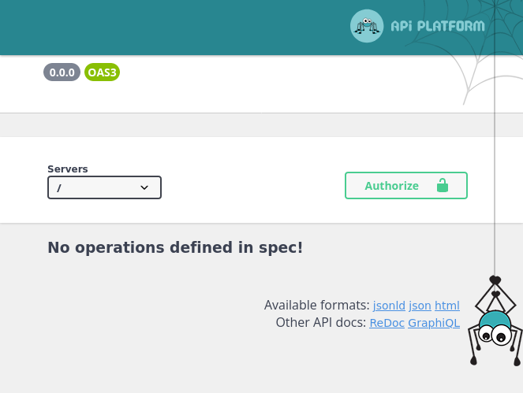
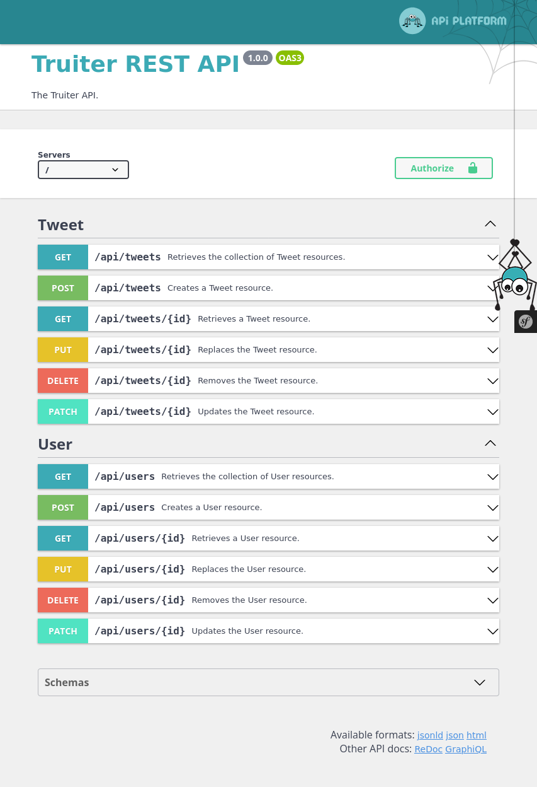

# Desenvolupament de serveis REST amb Symfony

## Introducció

Vegem ara quins passos donar per a construir una API REST que done
suport a les operacions bàsiques sobre una o diverses entitats:
consultes (GET), insercions (POST), modificacions (PUT) i esborrats
(DELETE).

A l'hora d'implementar una solució en Symfony ens trobem en tres opcions:

1. API senzilla amb els mètodes que ens proporciona la classe `AbstractController`.
2. Fer ús d'un _bundle_ com **FOSRestBundle** que ens permet una major flexibilitat.
3. Fer ús d'[API platform](https://api-platform.com), una ferramenta molt completa basada en PHP per a crear API Rest.

L'elecció d'una solució o altra dependrà de cada projecte. En aquest curs emprarem API platform.

## Pas 1: Arrencar del projecte

El projecte d'exemple serà un projecte independent basat en Truiter. Així podrem aprofitar el model de dades.

Primerament crearem el projecte de Symfony:

```console
composer create-project symfony/skeleton api-truiter-symfony ^5.4
``` 
En aquesta ordre crearem un projecte bàsic de Symfony en la versió 5.4, es tracta d'un projecte que no inclou ni Doctrine, 
ni Twig, per exemple.

Twig no serà necessari, ja que es tracta d'una API, però Doctrine, sí. A continuació instal·larem el paquet d'API platform que
inclou entre altres components Doctrine:

```console
composer require api
```

En accedir a `http://localhost/api` veurem la documentació de l'API:

<figure markdown>

<figcaption>
    http://localhost/api
</figcaption>
</figure>

Actualment no tenim res.

## Pas 2: Crear el model de dades

Les entitats i els repositoris els copiarem del projecte Truiter o podrem
crear-lo de nou fent ús del _Maker Bundle_.

En eixa cas caldrà instal·lar-lo. Aprofitarem per instal·lar altres components que 
ens seran útils.

```sh
composer require symfony/maker-bundle --dev
composer require doctrine/doctrine-fixtures-bundle --dev
composer require fakerphp/faker --dev
composer require mmo/faker-images --dev
composer require symfony/profiler-pack --dev 
composer require symfony/apache-pack
```
Llevarem les referències a VichUploader, ja que usarem els formularis d'una altra forma.

L'entitat Tweet quedaria així:

```php hl_lines="3 12"
namespace App\Entity;

use ApiPlatform\Metadata\ApiResource;
use App\Repository\TweetRepository;
use Doctrine\Common\Collections\ArrayCollection;
use Doctrine\Common\Collections\Collection;
use Doctrine\DBAL\Types\Types;
use Doctrine\ORM\Mapping as ORM;
use Symfony\Component\Validator\Constraints as Assert;

#[ORM\Entity(repositoryClass: TweetRepository::class)]
#[ApiResource]
class Tweet
{
    #[ORM\Id]
    #[ORM\GeneratedValue]
    #[ORM\Column]
    private ?int $id = null;

    #[ORM\Column(length: 280)]
    #[Assert\Length(min: 2, max: 280)]
    private ?string $text = null;

    #[ORM\Column(type: Types::DATETIME_MUTABLE)]
    #[Assert\NotBlank]
    private ?\DateTimeInterface $createdAt = null;

    #[ORM\Column]
    #[Assert\NotBlank]
    private ?int $likeCount = null;

    #[ORM\ManyToOne(inversedBy: 'tweets')]
    #[ORM\JoinColumn(nullable: false)]
    #[Assert\NotBlank]
    private ?User $author = null;

    #[ORM\OneToMany(mappedBy: 'tweet', targetEntity: Photo::class)]
    private Collection $attachments;
    
    //... 
}
```

L'atribute `#[ApiResource]` indica que aquesta entitat estarà exposada en la API.


!!! danger "Important"
    Si volem treballar en la nova versió de API platform ">=2.7" caldrà activar la següent configuració:
    ```yaml
    # api/config/packages/api_platform.yaml
    api_platform:
        metadata_backward_compatibility_layer: false
    ```

En accedir a la API ens mostrarà el següent:

<figure markdown>

</figure>

## Pas 3: Restringir operacions
[Enabling or disabling operations](https://api-platform.com/docs/core/operations/#enabling-and-disabling-operations)

## Pas 4: Filtrar per propietats
[Filters](https://api-platform.com/docs/core/filters/)

## Pas 5: Validar les dades
[Validating data](https://api-platform.com/docs/distribution/#validating-data)


## Pas 6: Provar la API

### Instal·lar el paquet de _testing_

Primerament caldrà instal·lar els paquets:

```sh
composer req --dev symfony/test-pack
composer req symfony/http-client
```

Aquest paquet instal·larà els paquets bàsics necessaris per començar.

### Preparar la base de dades de prova

Com que es tracta de proves funcionals que modificaran la base de dades és molt important 
tindre preparats unes dades de prova consistents amb `DoctrineFixturesBundles`.

!!! info "Entorn de proves"
    Recorda que has de configurar la base de dades en el fitxer `.env.test` i d'executar les ordres amb l'opció `--env=test` 
    perquè treballen en l'entorn de _testing`.

A més, és interessant [instal·lar i configurar](https://symfony.com/doc/current/testing.html#resetting-the-database-automatically-before-each-test) el paquet `dama/doctrine-test-bundle` que deixa la base de dades al seu estat inicial després de cada prova.

### Instal·lar paquets addicionals

Si volem fer proves amb `JSON Schema` per comprovar que les dades rebudes compleixen amb el seu esquema.

```sh
composer req --dev justinrainbow/json-schema
```

### Exemple

```php
namespace App\Tests\Service;

use ApiPlatform\Symfony\Bundle\Test\ApiTestCase;
use App\Entity\Tweet;
use DateTime;

class TweetsTest extends ApiTestCase
{
    public function testGetCollectionReturnsValidData(): void
    {
        $response = static::createClient()->request('GET', '/api/tweets',
            [ "headers" => ["Accept: application/json"]]
        );

        $this->assertResponseIsSuccessful();
        $this->assertMatchesResourceCollectionJsonSchema(Tweet::class);

        $this->assertCount(20, $response->toArray());

    }

    public function testPostValidData(): void
    {
        $response = static::createClient()->request('POST', '/api/tweets',
            [
                'headers' => ["Accept: application/json"],
                'json' => [
                    'text' => 'Proves',
                    'author' => '/api/users/1'
                ]
            ]
        );

        $date = new DateTime();
        $dateStr = $date->format('c');

        $this->assertResponseStatusCodeSame(201);
        $this->assertMatchesResourceItemJsonSchema(Tweet::class);

        $this->assertJsonContains([
                'text' => 'Proves',
                'createdAt' => $dateStr,
                'author' => '/api/users/1',
                'likeCount' => 0
        ]);

    }
}
```

Cal destacar que afegim `'headers' => ["Accept: application/json"]` per demanar la resposta
en format JSON bàsic. 

Respecte a la data, el que fem es passar-la en format **ISO 8601**.

[Functional tests](https://api-platform.com/docs/distribution/testing/#writing-functional-tests)

## Pas 7: Triar les propietats a exposar. Serialització

Abans d'entrar en màteria, és interessant tindre clars alguns conceptes:

* **Serialitzar**. La serialització és el procés de convertir un objecte en una altre format per a emmagatzemar-lo o transmetre'l i posteriorment ser decodificat.
* **Normalitzar.** Ajuden en el procés de serialització, convertint els objectes en un element intermig, com pot ser una array.

<figure markdown>

</figure>

El `serializer` de Symfony ens permetrà definir quines propietats exposem depenent del context.

[The Serialization Process](https://api-platform.com/docs/core/serialization/)

En el cas que ens ocupa, a l'hora de crear un nou `Tweet`, que un usuari puga enviar la data de creació
o el número de _likes_ no és desitjable. En canvi, en el cas de recuperar els tweets sí que té sentit.

Gràcies a Symfony Serializer podrem configurar este escenari.

API Platform permet definir el contex fent ús dels grups i així controlar que es mostra en llegir (normalització) i 
en escriure (denormalització).

### Activar les anotacions

```yaml
# config/packages/framework.yaml
framework:
    serializer: { enable_annotations: true }
```

### Aplicar-les als recursos

```php hl_lines="8 12 16"
...
#[ApiResource(
    normalizationContext: ['groups' => ['read']],
    denormalizationContext: ['groups' => ['write']],
)]
class Tweet {
    #[ORM\Column(length: 280)]
    #[Groups(['read', 'write'])]
    private ?string $text = null;

    #[ORM\Column(type: Types::DATETIME_MUTABLE)]
    #[Groups(['read'])]
    private ?\DateTimeInterface $createdAt = null;

    #[ORM\Column]
    #[Groups(['read'])]
    private ?int $likeCount = null;
}
```
D'esta forma aconseguiríem que en fer GET es mostraren els tres camps però 
en fer POST sols `text`.


## Recursos

- [Repositori de Github de Truiter API](https://github.com/corriol/2023-truiter-api)
- [API Platform Crash Course](https://www.youtube.com/watch?v=ZRBRtA_2NAo)
- [API Platform 3: Mythically Good RESTful APIs](https://symfonycasts.com/screencast/api-platform)
* En [Primeros pasos con Symfony 5 como API REST](https://itdo-solutions.medium.com/primeros-pasos-con-symfony-5-como-api-rest-f0fa8c4d5962) 
es genera una API basada en els mateixos components que hem utilitzat.
* En [Getting started REST API with Symfony 4](https://www.adcisolutions.com/knowledge/getting-started-rest-api-symfony-4) 
s'utilitzen diversos components addicionals com el Fos-Rest-Bundle i JMS Serializer.
* En [Curso de Symfony 5. Creando una API desde cero](https://www.youtube.com/playlist?list=PLC8ntN5__iMIAy9V6XO37Dx_bQ5V7zc-h) teniu
un curs molt complet sobre com crear una API en Symfony 5 des de cero.
* [API Platform](https://api-platform.com/docs/core/getting-started/) és un framework que permet crear API de forma quasi automàtica en
Symfony.
*  [https://medium.com/francisco-ugalde/restful-api-con-symfony-4-jwt-parte-1-2accdf59a0ae](https://medium.com/francisco-ugalde/restful-api-con-symfony-4-jwt-parte-1-2accdf59a0ae)