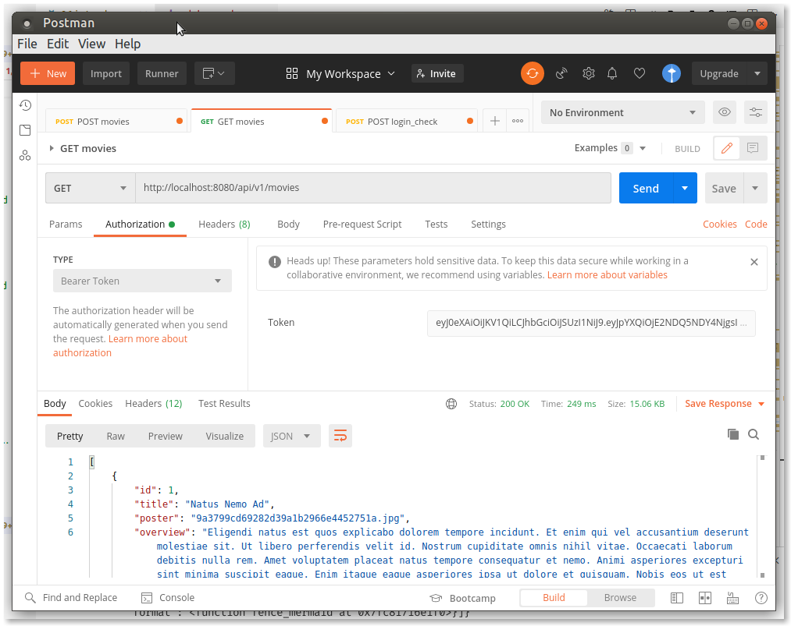

# JWT (JSON Web Token)

Els mecanismes d'autenticació tradicional en aplicacions web estan
basats en sessions: l'usuari envia les seues credencials a través
d'algun formulari, el servidor les valida i emmagatzema en la sessió les
dades de l'usuari, perquè, mentre no caduque la sessió o la
tanque l'usuari, puga seguir accedint sense haver de tornar a
autenticar-se.

No obstant això, aquest tipus d'autenticació té la limitació de ser
exclusiva per a aplicacions web, és a dir, per a clients web que es
connecten a servidors web. Si volguérem adaptar l'aplicació a mòbil, o
a una versió d'escriptori, no podríem seguir emprant aquest mecanisme.

Per a superar aquest escull, podem utilitzar **l'autenticació basada en
_tokens_**. Aquesta és una autenticació "sense estat" (_stateless_), la qual
cosa significa que no s'emmagatzema res entre client i servidor per a
seguir accedint autenticats. El que es fa és el següent:

1.  El client envia al servidor les seues credencials (usuari i
    contrasenya)
2.  El servidor les valida, i si són correctes, genera una cadena
    xifrada anomenada _token_, que conté la validació de l'usuari, a més
    de certa informació addicional que puguem voler afegir (com el nom d'usuari, 
    per exemple). Aquest _token_ s'envia de tornada a
    l'usuari com a resposta a la seua autenticació.
3.  A partir d'aquest punt, cada vegada que el client vullga
    autenticar-se contra el servidor per a sol·licitar un recurs, n'hi
    ha prou en que envie el _token_ que el servidor li va proporcionar. El
    servidor s'encarregarà de verificar-lo per a comprovar que és
    correcte, i donar-li accés o denegar-li'l.

Igual que les sessions, els _tokens_ també poden tenir una caducitat, que
s'indica dins del propi _token_. Si, passat aqueix temps, el servidor rep
el _token_, ho descartarà com a invàlid (caducat), i el client tornarà a
no estar autenticat.

_JSON Web Token_ és un estàndard obert ([RFC 7519](https://tools.ietf.org/html/rfc7519)) que defineix un mode compacte i 
autònom de transmetre de forma segura la informació entre dues parts com un 
objecte JSON. Aquesta informació pot ser verificada i és fiable perquè està signada digitalment.

Els JWT es poden signar usant un _secret_ (amb l'algoritme HMAC) o utilitzant un parell
de claus públiques/privades usant RSA i contenen la informació de l'usuari 
autenticat.

## Estructura del _token_

<figure markdown>
{ width="800"}
  <figcaption>Exemple de token extret de jwt.io</figcaption>
</figure>

## Cicle de vida del token JWT

<figure markdown>
{ width="800"}
<figcaption>Intercanvi de missatges</figcaption>
</figure>

## Implementació en Symfony

Per a poder treballar amb JWT en Symfony, podem emprar (entre 
altres) el _bundle_ `lexik/LexikJWTAuthenticationBundle`, que s'instal·la
d'aquesta manera:

```console
composer require jwt-auth
```
A més, necessitarem afegir el _bundle_ de seguretat de Symfony:

```console
composer require security
```

### Entitat User

Caldrà disposar d'una entitat que implemente la interfície `UserInterface` que ja tenim del projecte anterior. 

### Endpoints

Usarem un _endpoint_:

- `/login` serà la que validarà les credencials.

### Generació de certificats

Per a poder codificar els _tokens_, és necessari generar un parell de certificats.

Generarem un privat per a generar el _token_ quan l'usuari es valide,
i un públic per a poder-lo validar quan l'usuari l'envie.

Per a açò, executem la següent ordre des del directori arrel del
projecte. 

```terminal
php bin/console lexik:jwt:generate-keypair
```

Amb aquesta ordre es crearà una clau privada,
i una pública a partir de la privada. Aquestes claus requeriran una contrasenya
que es genera automàticament i es troba en el fitxer `.env`, en la clau `JWT_PASSPHRASE`.


En el fitxer `.env` s'hauran creat estes línies:

```env
JWT_SECRET_KEY=%kernel.project_dir%/config/jwt/private.pem
JWT_PUBLIC_KEY=%kernel.project_dir%/config/jwt/public.pem
JWT_PASSPHRASE=14ea51a657fac12644ab2653d8933644
```

I en el fitxer de configuració `config/packages/lexik_authentication.yaml` estes:

```yaml
lexik_jwt_authentication:
    secret_key: '%env(resolve:JWT_SECRET_KEY)%' # required for token creation
    public_key: '%env(resolve:JWT_PUBLIC_KEY)%' # required for token verification
    pass_phrase: '%env(JWT_PASSPHRASE)%' # required for token creation
```

### Configuració de `config/packages/security.yaml`

L'arxiu principal de seguretat `config/packages/security.yaml` haurà de
contenir aquests atributs per a l'autenticació per _token_:

```yaml
# config/packages/security.yaml
security:
    # https://symfony.com/doc/current/security.html#c-hashing-passwords
    password_hashers:
        App\Entity\User: 'auto'

    # https://symfony.com/doc/current/security/authenticator_manager.html
    enable_authenticator_manager: true
    # https://symfony.com/doc/current/security.html#where-do-users-come-from-user-providers
    providers:
        # used to reload user from session & other features (e.g. switch_user)
        users:
            entity:
                class: App\Entity\User
                property: username

    firewalls:
        dev:
            pattern: ^/_(profiler|wdt)
            security: false
        api:
            pattern: ^/api/
            stateless: true
            provider: users
            jwt: ~
        main:
            json_login:
                check_path: login # The name in routes.yaml is enough for mapping
                username_path: username
                password_path: password
                success_handler: lexik_jwt_authentication.handler.authentication_success
                failure_handler: lexik_jwt_authentication.handler.authentication_failure


    access_control:
        - { path: ^/$, roles: PUBLIC_ACCESS } # Allows accessing the Swagger UI        
        - { path: ^/login, roles: PUBLIC_ACCESS } # Allows accessing login controller
        - { path: ^/api$, roles: PUBLIC_ACCESS } # Allows accessing the doc
        - { path: ^/, roles: IS_AUTHENTICATED_FULLY } # Forces authentication in all the requests
```

Caldrà afegir també la següent ruta en `config/routes.yaml`:

```yaml
login:
    path: /login
```

El que hem definit en aquest fitxer és:

-  El _firewall_ `main` que s'activarà en accedir a la ruta `/login`. Ruta que serà pública, com s'observa en `access_control`.
- `json_login` indica que s'espera una sol·licitud via JSON.
- El _firewall_ `api` s'activarà en la resta de rutes de la API, on s'indicarà que cap aplicar l'autenticació jwt.
- `jwt: ~` activa l'autenticador JWT.

### Provant l'autenticació

Per a provar que l'autenticació funciona, crearem una nova petició
POST en Postman a la URI `/login`, i li passem en el cos de
la petició l'usuari (_username_) i la contrasenya (_password_). En aquest
exemple, suposem que l'usuari és `user` i la contrasenya (sense
encriptar) és `user`. Haurem d'afegir també una capçalera (Header) amb
l'atribut `Content­Type` establit a `application/json`.

!!! info "Tests"
    Seria interessant crear un _test_ que a més ens permetrà provar el control d'accés.

Si tot va correctament, rebrem com a resposta un _token_:

<figure markdown>

<figcaption>Provant l'autenticació amb Postman</figcaption>
</figure>

Si analitzem el _token_ obtindrem:
<figure markdown>

<figcaption>Anàlisi del token</figcaption>
</figure>

La signatura és invàlida ja que no s'ha pogut verificar amb les claus pública
i privada.


### Provant l'autorització

Ara, obtindrem un llistat de tweets. Si llancem la
petició en Postman (o en el test) sense cap tipus d'autorització, rebrem aquest
missatge:

```json
{
    "code": 401,
    "message": "JWT Token not found"
}
```

Hem d'afegir una capçalera `Authorization` el valor de la qual siga el
prefix `"Bearer "` (incloent l'espai final) seguit del _token_ que ens ha
enviat el servidor en autenticar-nos:

<figure markdown>

<figcaption>Sol·licitud amb el token inclòs</figcaption>
</figure>


D'aquesta forma sí que obtindrem el llistat de tweets. Haurem de procedir 
de la mateixa forma (enviant el _token_ en la capçalera `Authorization`) per a
poder emprar la resta de sol·licituds.

### Activar l'autorització des de la documentació

Primerament vincularem el sistema d'autenticació afegint:

```yaml
# config/packages/api_platform.yaml
api_platform:
    swagger:
         api_keys:
             JWT:
                name: Authorization
                type: header
```

Després, per poder provar l'autenticació, afegirem en `lexik_jwt_authentication.yaml`:

```yaml
    api_platform:
        check_path: /login
        username_path: username
        password_path: password
```

Una vegada obtingut el _token_ caldrà afegir-lo a la capçalera des del botó `[Authorize]`,
introduint el text: `Bearer NEW_TOKEN`. Canviant `NEW_TOKEN` pel _token_ obtingut.

## Recursos
- [JWT Authentication](https://api-platform.com/docs/core/jwt/) en API Platform
- [Security](https://api-platform.com/docs/core/security/) en API Platform
- [https://jwt.io/](https://jwt.io/)
- [Functional Testing with JWT Authentication Bundle](https://github.com/lexik/LexikJWTAuthenticationBundle/blob/2.x/Resources/doc/3-functional-testing.rst)
- [LexikJWTAuthenticationBundle](https://github.com/lexik/LexikJWTAuthenticationBundle)
- [https://enmilocalfunciona.io/construyendo-una-web-api-rest-segura-con-json-web-token-en-net-parte-i/](https://enmilocalfunciona.io/construyendo-una-web-api-rest-segura-con-json-web-token-en-net-parte-i/)
- [https://www.adictosaltrabajo.com/2017/09/25/securizar-un-api-rest-utilizando-json-web-tokens/](https://www.adictosaltrabajo.com/2017/09/25/securizar-un-api-rest-utilizando-json-web-tokens/)
- [https://developer.mozilla.org/en-US/docs/Web/HTTP/CORS](https://developer.mozilla.org/en-US/docs/Web/HTTP/CORS)

